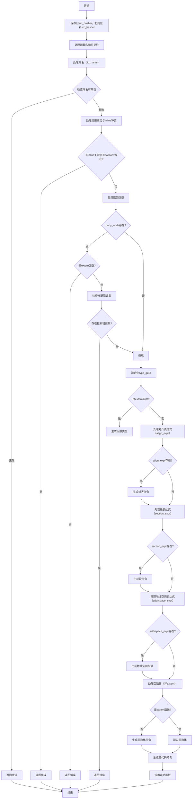

嗯，我需要用Mermaid来画这个Zig函数`fnDecl`的流程图。首先，我应该仔细阅读这个函数，理解它的逻辑结构。这个函数看起来是处理函数声明的，涉及到AST生成和一些代码生成的部分。

首先，函数开始的时候，保存了旧的`src_hasher`，然后初始化了一个新的。之后处理函数名、可见性、导出等属性。接着处理库名，检查是否有无效字符或空名。然后处理返回类型，检查是否是推断错误，以及是否有函数体。如果没有函数体且不是extern函数，会报错。

接下来，创建了多个GenZir块，比如type_gz、align_gz、linksection_gz、addrspace_gz和value_gz，每个块处理不同的部分，比如对齐、段、地址空间和函数体。最后，生成哈希并设置声明属性。

我需要将这些步骤分解成流程图中的各个节点。注意条件判断和错误处理的分支。例如，处理`lib_name`时，如果有错误会返回错误；检查`body_node`是否存在，以及是否是extern函数等条件。

可能需要用不同的形状表示开始/结束、处理步骤、条件判断和错误处理。比如，矩形表示步骤，菱形表示条件判断，平行四边形表示输入/输出，圆形表示开始和结束。

在画流程图的时候，要按顺序处理各个部分，包括初始化、参数检查、各个块的创建和处理，最后设置声明。同时要注意defer语句，比如`defer astgen.within_fn = prev_within_fn;`，这可能在流程中影响状态恢复。

另外，函数中有多个子块，比如type_gz、align_gz等，每个块的处理可能是一个子流程。不过为了简化，可能将这些子块的处理步骤作为主流程中的步骤，而不是展开子流程。

需要确保所有的条件分支都被覆盖，例如检查`is_extern`、`is_export`、`has_inline_keyword`等，以及各个表达式是否存在（如`align_expr`、`section_expr`等）。

最后，生成哈希并设置声明的部分也是流程的重要步骤，需要包含在流程图中。

现在，我需要将这些步骤和条件判断转化为Mermaid的流程图语法，确保逻辑正确，结构清晰。
================================================
