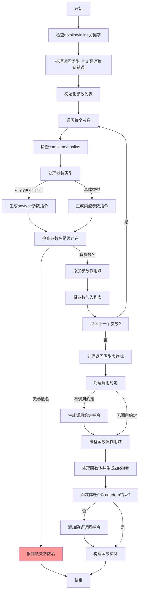

嗯，我现在要分析这个Zig函数`fnDeclInner`，并画出它的流程图。首先，我需要理解这个函数的作用。看起来这个函数是处理函数声明的内部逻辑，生成ZIR（Zig Intermediate Representation）指令。函数参数很多，包括AST生成器、作用域、节点信息等。

首先，我会通读代码，了解大致的结构。函数开始处理函数的声明，检查是否有`noinline`或`inline`关键字，然后处理返回类型，判断是否是推断错误类型。接着处理参数，包括参数的名称、类型、是否是`anytype`，以及处理参数的别名和编译时参数。然后处理返回类型和作用域，接着处理调用约定（calling convention）。之后处理函数体，生成函数体的ZIR指令，最后构建函数实例并添加到当前的作用域中。

接下来，我需要将这个过程分解成步骤，每个步骤对应流程图中的一个节点。可能的步骤包括：

1. 检查`noinline`和`inline`关键字。
2. 处理返回类型，判断是否是推断错误。
3. 初始化参数列表，处理每个参数：
   a. 检查是否是`comptime`或`noalias`。
   b. 处理参数类型（`anytype`或具体类型）。
   c. 处理参数名称，防止作用域冲突。
   d. 生成参数的ZIR指令。
4. 处理返回类型的作用域和表达式。
5. 处理调用约定（calling convention）的表达式。
6. 处理函数体，生成对应的ZIR指令，包括隐式返回。
7. 构建最终的函数实例并添加到当前块。

需要注意条件分支，比如是否有`inline`关键字，参数的类型是否是`anytype`，是否省略参数名导致错误等。此外，错误处理也是流程中的一部分，比如`try`语句可能引发错误，需要在流程图中体现可能的错误路径。

在画流程图时，需要将这些步骤用矩形框表示，判断条件用菱形框，箭头表示流程方向。可能的分支包括处理不同参数类型、是否有调用约定表达式、函数体是否以无返回结束等。

需要确认每个步骤之间的顺序和依赖关系。例如，参数处理必须在处理返回类型之前，因为返回类型的作用域可能包含参数。调用约定处理可能在参数和返回类型处理之后。函数体的处理可能在所有参数和返回类型处理完成后进行。

另外，代码中有一些循环结构，比如遍历函数参数的部分，这在流程图中可能需要用循环结构表示。不过，在流程图中通常用条件判断和箭头来表示循环，例如用“还有参数吗？”作为判断节点，如果是则处理下一个参数，否则继续后续步骤。

最后，生成函数实例的部分可能需要收集之前处理的所有信息（参数、返回类型、调用约定、函数体）来构造最终的ZIR指令。这一步之后，函数流程结束。

需要注意的是，代码中有很多错误处理，比如`try`和`return`语句，这些在流程图中可能需要表示为错误路径，或者可能直接终止流程。但为了简化，可能暂时忽略错误处理，专注于主流程，之后再补充错误分支。

总结一下，主流程的大致步骤是：

开始 -> 检查inline/noinline -> 处理返回类型 -> 初始化参数列表 -> 循环处理每个参数 -> 处理返回类型作用域 -> 处理调用约定 -> 处理函数体 -> 构建函数实例 -> 结束。

每个步骤中的条件判断需要分支处理，比如是否有inline关键字，参数是否是anytype等。

现在需要将这些步骤转化为mermaid的流程图语法，确保逻辑正确，分支清晰。
================================================

流程图说明：
1. 从检查函数修饰符开始，处理返回类型推断
2. 通过循环处理每个参数，包括类型检查和作用域管理
3. 处理返回类型表达式和调用约定
4. 生成函数体指令并处理隐式返回逻辑
5. 最终构建完整的函数ZIR指令
6. 红色节点表示错误处理路径