嗯，用户让我用Mermaid画出一个Zig函数的流程图。首先，我需要理解这个函数的功能。这个函数叫做`forExpr`，看起来是处理Zig中的for循环表达式，生成对应的ZIR（Zig Intermediate Representation）指令。函数参数包括父GenZir指针、作用域、结果信息、AST节点等等。

首先，我需要理清函数的主要步骤。函数开始检查是否有标签，处理结果信息，然后处理循环的索引变量和长度检查。接着创建循环块（loop block）、条件块（cond block）和处理then和else分支的作用域。最后处理循环的递增和重复逻辑。

接下来，我应该将整个函数分解成几个主要部分：

1. **初始检查和准备**：检查标签是否重复，处理结果信息，确定是否需要rvalue，检查内联关键字。
2. **处理输入（indexables和lens）**：遍历输入节点，处理计数器或索引变量，收集长度信息。
3. **创建循环结构**：分配索引指针，初始化计数器，创建循环块和条件块。
4. **条件判断**：生成条件表达式，设置条件分支。
5. **处理then分支**：创建then作用域，处理捕获变量，生成then部分的ZIR指令。
6. **处理else分支**（如果有的话）：创建else作用域，生成else部分的指令。
7. **循环递增和重复**：更新索引变量，生成重复指令，设置循环块的主体。
8. **结果处理**：根据需要生成rvalue，确保结果被使用。

在画流程图时，每个步骤应该对应一个节点，根据条件判断（如是否有else分支，是否需要rvalue）会有不同的分支。需要注意循环结构中的条件判断和分支跳转。

可能遇到的难点是如何正确表示循环块和条件块之间的关系，以及如何处理多个作用域（如loop_scope、cond_scope、then_scope、else_scope）之间的嵌套和跳转。此外，函数中有很多错误检查和特殊情况处理（如标签未使用、内联关键字在comptime中的冗余等），这些也需要在流程图中体现。

需要确认各个部分的执行顺序和条件，例如，当输入是for_range时的处理，以及当没有else分支时的默认处理。此外，函数末尾的结果处理部分根据是否是语句来决定是否添加ensure_result_used指令，这也需要在流程图中体现。

最后，确保流程图的结构清晰，步骤之间的逻辑关系正确，特别是循环和条件分支的结构需要正确嵌套和连接。
================================================

```mermaid
graph TD
    Start[开始] --> CheckLabel{检查标签是否重复}
    CheckLabel --> PrepareRL[准备结果信息]
    PrepareRL --> CheckInline{检查内联关键字}
    CheckInline --> InitIndexPtr[初始化索引指针]
    InitIndexPtr --> ProcessInputs[处理输入节点]
    ProcessInputs --> AnyLenChecks{存在长度检查?}
    AnyLenChecks -- 否 --> ErrorUnbounded[报错无限循环]
    AnyLenChecks -- 是 --> CreateLenInst[创建长度检查指令]
    CreateLenInst --> CreateLoopBlock[创建循环块]
    CreateLoopBlock --> CreateCondBlock[创建条件块]
    CreateCondBlock --> GenCond[生成条件表达式]
    GenCond --> CreateCondBr[创建条件分支]
    CreateCondBr --> ThenBlock[处理then分支]
    ThenBlock --> CaptureVars[处理捕获变量]
    CaptureVars --> GenThenBody[生成then体代码]
    GenThenBody --> ThenBreak[生成then分支break]
    ThenBreak --> ElseBlock{存在else分支?}
    ElseBlock -- 是 --> GenElseBody[生成else体代码]
    GenElseBody --> ElseBreak[生成else分支break]
    ElseBlock -- 否 --> GenDefaultElse[生成默认else处理]
    GenDefaultElse --> ElseBreak
    ElseBreak --> CheckLabelUsed{标签是否使用?}
    CheckLabelUsed -- 未使用 --> WarnLabel[警告未使用标签]
    CheckLabelUsed --> UpdateIndex[更新索引变量]
    UpdateIndex --> GenRepeat[生成重复指令]
    GenRepeat --> FinalResult[处理最终结果]
    FinalResult --> CheckStatement{是否是语句?}
    CheckStatement -- 是 --> AddEnsureUsed[添加ensure_result_used]
    CheckStatement -- 否 --> End[结束]
    AddEnsureUsed --> End

    %% 异常处理路径
    ErrorUnbounded --> End
    WarnLabel --> UpdateIndex
    
    %% 样式定义
    classDef decision fill:#f9f,stroke:#333,stroke-width:2px;
    classDef process fill:#bbf,stroke:#333,stroke-width:2px;
    classDef startend fill:#fbb,stroke:#333,stroke-width:2px;
    
    class CheckLabel,CheckInline,AnyLenChecks,ElseBlock,CheckLabelUsed,CheckStatement decision;
    class PrepareRL,InitIndexPtr,ProcessInputs,CreateLenInst,CreateLoopBlock,CreateCondBlock,GenCond,CreateCondBr,ThenBlock,CaptureVars,GenThenBody,ThenBreak,GenElseBody,ElseBreak,GenDefaultElse,UpdateIndex,GenRepeat,FinalResult,AddEnsureUsed process;
    class Start,ErrorUnbounded,WarnLabel,End startend;
```
