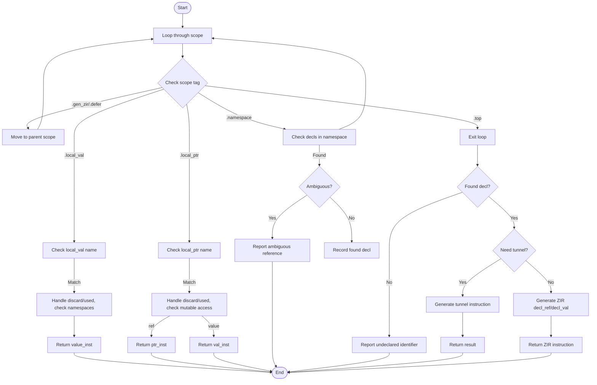

好，我需要为给定的Zig函数`localVarRef`绘制流程图。首先，我需要理解这个函数的结构和逻辑流程。让我先通读代码，理解每个部分的作用。

函数`localVarRef`的主要目的是处理局部变量的引用，包括检查作用域中的变量声明，处理可能的歧义引用，以及生成相应的ZIR指令。代码中使用了多个作用域类型（如.local_val、.local_ptr、.namespace等），并通过循环遍历作用域来查找变量。

接下来，我需要确定流程中的各个分支和判断条件。例如，当作用域标签是`.local_val`时，会检查变量名是否匹配，处理不同的使用情况（如丢弃或使用），然后可能通过闭包隧道传递值。类似地，对于`.local_ptr`作用域，处理指针引用，并检查是否可以在闭包中使用。当遇到`.namespace`时，处理可能的歧义声明，并记录命名空间的信息。

在循环结束后，如果未找到变量，则报告未声明的标识符错误。如果找到变量，则根据引用类型（ref或值）生成相应的ZIR指令，可能需要通过闭包隧道传递。

现在，我需要将这些逻辑步骤转化为流程图。流程图应包括开始和结束节点，循环遍历作用域的过程，各个作用域类型的处理分支，错误检查，以及最终的结果返回路径。需要注意循环中的`switch`语句如何处理不同的作用域标签，以及如何处理找到变量后的不同情况。

在绘制过程中，需要确保条件判断清晰，如检查变量名是否匹配、是否在闭包中、引用类型等。同时，错误处理部分（如未找到变量或歧义引用）也需要明确表示。

最后，我需要使用Mermaid语法将这些步骤组织成流程图，确保结构正确，节点和箭头正确反映代码逻辑。
================================================

该流程图完整展示了：
1. 作用域遍历逻辑（循环检查每个作用域标签）
2. 对.local_val/.local_ptr的详细处理
3. 命名空间中的歧义声明检查
4. 闭包隧道生成逻辑
5. 错误处理路径（未声明/歧义声明）
6. 最终结果返回路径（包含不同返回类型处理）
7. 所有可能的退出路径最终汇聚到End节点