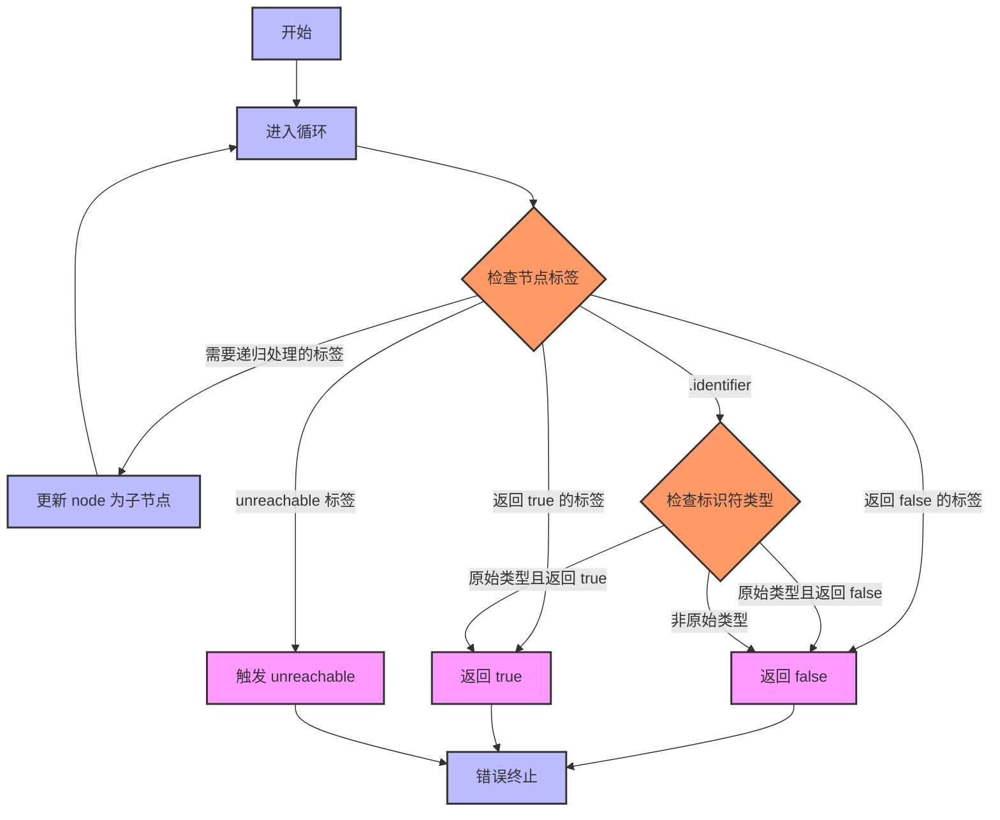

好的，我需要为这个Zig函数`nodeImpliesMoreThanOnePossibleValue`画一个流程图。首先，我需要理解这个函数的功能。看起来这个函数是用来判断一个AST节点是否可能包含多个值。函数通过遍历节点并根据节点类型返回true或false。

首先，函数开始于一个`start_node`，然后进入一个无限循环，通过`switch`语句检查节点的标签。不同的标签会导致不同的处理方式，比如直接返回false、继续遍历子节点，或者返回true。

我需要将这个逻辑转化为流程图。流程图的基本结构应该是一个开始节点，然后进入循环，根据不同的节点标签分支处理。需要注意的是，有些情况会直接返回，有些会继续循环，修改当前节点为子节点，再次循环处理。

首先，开始流程。然后进入循环，检查节点标签。对于某些标签，直接触发`unreachable`，这可能表示这些情况不应该出现。接下来，对于返回false的情况，直接结束流程。对于需要继续处理的情况，比如`.@"try"`、`.grouped_expression`等，会更新`node`为子节点，然后继续循环。而对于返回true的情况，比如某些指针类型或数组类型，直接返回true。

另外，对于`.identifier`的情况，需要检查标识符是否是原始类型，根据不同的原始类型返回true或false。这里可能需要一个子流程来判断标识符的类型。

在绘制流程图时，需要注意循环的结构，以及各个分支的条件判断。可能需要使用条件判断框来表示不同的节点标签，然后根据不同的情况连接到相应的处理步骤。

总结步骤：
1. 开始。
2. 进入循环。
3. 检查节点标签。
4. 根据不同标签处理：
   - 触发unreachable的情况（可能错误情况）。
   - 直接返回false的情况。
   - 需要继续处理子节点的情况，更新node后回到循环开始。
   - 直接返回true的情况。
   - 处理.identifier的特殊情况，检查标识符类型后返回相应结果。
5. 结束流程。

需要确保所有分支都被覆盖，特别是循环中的处理，避免遗漏任何可能的节点标签。同时，注意处理.identifier时的条件分支，可能需要进一步的子判断。
================================================
