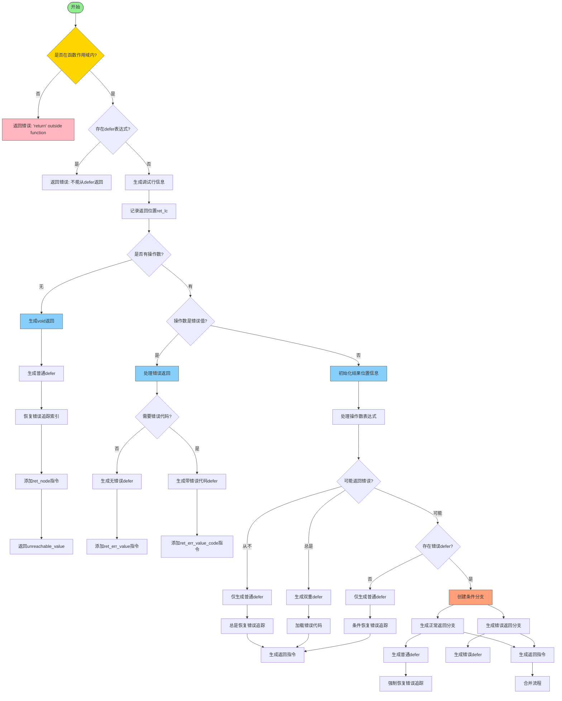

好的，我需要为提供的Zig函数`ret`绘制一个流程图。首先，我得仔细阅读代码，理解它的逻辑结构。函数的主要功能是处理`return`语句的生成ZIR指令的过程。

首先，函数开始检查是否在函数作用域内，如果不是，返回错误。然后检查是否有`defer`表达式，如果有的话，同样返回错误。接下来处理调试信息的生成，记录返回的位置。然后根据是否有操作数（即返回值）分两种情况处理。

如果没有操作数（返回void），处理普通`defer`，生成返回指令。如果有操作数，需要进一步判断操作数是否是错误值。如果是错误值，处理错误相关的`defer`，生成对应的返回指令。如果不是错误值，处理结果的位置信息，生成相应的加载或返回指令，并根据是否可能返回错误来决定如何处理`defer`和生成条件分支。

在流程图中，需要将这些条件分支和步骤清晰地展示出来。比如，判断是否有操作数，操作数是否是错误值，是否需要处理错误`defer`，以及生成不同的返回指令等。同时，需要注意代码中的条件判断和循环结构，如`switch`语句和`if`条件，以及子作用域的创建和处理。

可能需要注意的步骤包括：检查函数作用域、处理`defer`、生成调试信息、处理不同的返回情况（void、错误值、普通值）、处理错误`defer`的条件分支等。需要将这些步骤用流程图节点表示，并用箭头连接判断和操作步骤，确保逻辑正确。

另外，代码中有一些复杂的部分，例如处理结果位置信息（`ResultInfo`）、匿名名称策略的切换、以及条件分支中的子作用域处理。这些部分需要在流程图中适当简化，同时保持关键逻辑的清晰。

最后，确保流程图的每个判断节点都有两个或多个出口（是/否），每个处理步骤按顺序连接，循环结构正确表示。可能还需要注释说明某些复杂步骤，例如`genDefers`的不同模式和`addRestoreErrRetIndex`的作用。
================================================
