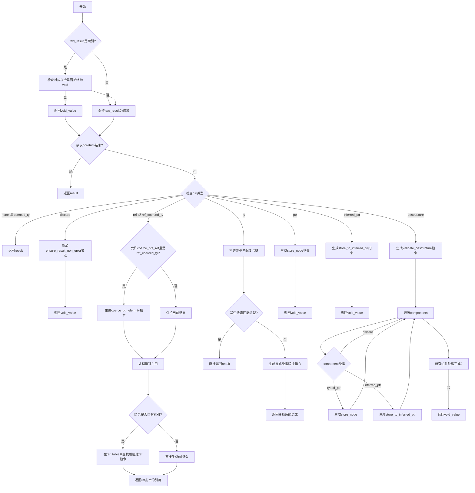

嗯，用户让我用Mermaid画出一个Zig函数的流程图。这个函数是`rvalueInner`，看起来处理的是右值内部逻辑，可能和ZIR（Zig Intermediate Representation）生成有关。首先，我需要理解这个函数的结构和各个分支。

函数一开始有一个块，检查`raw_result`是否为索引，如果是的话，检查对应的指令是否是始终为void，如果是的话就返回void_value。接着判断`gz`是否以无返回结束，如果是的话直接返回结果。然后是一个大的switch语句，处理`ri.rl`的不同情况，比如`.none`, `.coerced_ty`, `.discard`, `.ref`, `.ref_coerced_ty`等等。

每个case里面有不同的处理逻辑。例如，`.discard`情况下会添加一个确保结果非错误的节点，并返回void_value。`.ref`和`.ref_coerced_ty`需要处理指针引用，可能涉及到创建引用或复用已有的。`.ty`的情况比较复杂，有很多类型检查，快速判断是否类型匹配，如果匹配就直接返回结果，否则添加类型转换指令。`.ptr`和`.inferred_ptr`处理存储到指针的情况，`.destructure`处理解构的情况，比如元组或结构体的解构赋值。

我需要将这些逻辑步骤转化为流程图。首先，流程图的开始是函数入口，然后依次处理各个条件分支。每个条件判断对应不同的处理路径，比如检查`raw_result`是否为索引，然后是否以无返回结束，接着根据`ri.rl`的不同分支处理。

需要注意的是，有些分支内部还有进一步的判断，比如在`.ty`的情况下，有很多快速路径判断类型是否匹配，如果匹配就直接返回，否则添加转换指令。这部分可能需要多个条件判断节点。

另外，`.destructure`分支里有一个循环，遍历各个组件，根据组件类型进行不同的处理。这在流程图中应该表现为一个循环结构，处理每个组件。

可能遇到的挑战是如何将复杂的条件分支和嵌套的switch结构清晰地表达在流程图中，避免过于复杂。需要合理分组，使用子流程或者条件节点来简化。

总结步骤：
1. 函数开始，处理raw_result是否为索引，是否始终为void。
2. 检查gz是否以noreturn结束，如果是则返回结果。
3. 根据ri.rl的不同分支，分别处理每个case。
4. 每个case内部可能有进一步的判断和处理逻辑，比如类型匹配、存储到指针、解构赋值等。
5. 最终返回相应的结果。

需要将这些步骤用Mermaid的流程图语法表示出来，合理使用条件判断、子流程和循环结构。
================================================

该流程图关键特征：
1. 使用复合条件判断处理类型系统快速路径
2. 对指针引用场景采用缓存机制（ref_table）
3. 解构赋值（destructure）使用循环结构处理嵌套组件
4. 对常见类型组合进行快速短路优化
5. 不同结果位置（rl）采用独立处理分支
6. 包含ZIR指令生成的详细逻辑路径