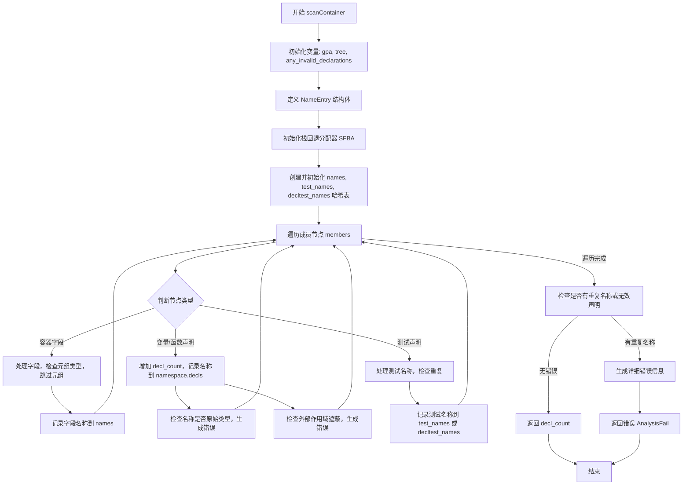

好的，我需要为给定的 Zig 函数 `scanContainer` 绘制一个流程图。首先，我需要理解这个函数的结构和逻辑流程。

首先，函数 `scanContainer` 接受一些参数，包括 `astgen`、`namespace`、`members` 和 `container_kind`，然后返回一个 `u32` 或者错误。它的主要任务似乎是扫描容器（如结构体、联合体等）的成员，并进行各种检查，比如重复名称、无效声明等。

接下来，我需要逐步分析函数的各个部分：

1. **初始化部分**：函数开始时声明了一些变量，比如 `gpa`、`tree`，以及 `any_invalid_declarations` 标志。然后定义了 `NameEntry` 结构体，用于处理名称重复的情况。

2. **栈回退分配器（SFBA）的初始化**：使用栈回退分配器来管理临时内存，避免频繁使用全局分配器（GPA）。

3. **哈希表的创建和初始化**：创建了三个哈希表 `names`、`test_names` 和 `decltest_names`，用于存储不同类型的名称条目，并在函数结束时释放这些哈希表。

4. **遍历成员节点**：使用 `for` 循环遍历每个 `member_node`，根据节点的类型（如字段、声明、测试声明等）进行处理。对于每个成员，提取名称并进行不同的处理：

   - **容器字段**：处理结构体、联合体等的字段，检查是否是元组类型，如果是则跳过。
   - **变量和函数声明**：增加 `decl_count`，并将名称存入 `namespace.decls`。
   - **测试声明**：处理测试名称，检查是否有重复的测试名称。
   
5. **名称重复检查**：在处理每个成员时，检查名称是否已经存在于对应的哈希表中。如果存在重复，则记录错误，并链接到已有的条目。

6. **原始名称检查**：对于声明名称，检查是否与原始类型名称冲突，如果是，则生成错误。

7. **作用域链检查**：遍历父作用域，检查当前声明的名称是否遮蔽了外部作用域中的变量，如果是，则生成错误。

8. **错误处理部分**：在遍历完所有成员后，检查是否有重复的名称或无效声明。如果有重复名称，生成详细的错误信息，包括所有重复的位置。

9. **返回结果**：如果没有错误，返回 `decl_count`，否则返回错误。

现在，我需要将这些步骤转化为流程图。流程图的节点应该包括函数的主要步骤，如初始化、遍历成员、处理不同类型节点、检查重复名称、生成错误等。判断节点需要处理各种条件，例如是否有重复名称、是否是有效声明等。

需要注意的是，流程图中需要涵盖循环结构（如遍历 `members`）和条件分支（如不同类型的成员处理，是否存在重复名称等）。此外，错误处理部分需要显示生成错误信息并最终返回错误。

可能遇到的挑战是如何简洁地表示循环和条件分支，尤其是当多个条件嵌套时。需要确保每个分支都清晰，并且整个流程图易于理解。

最后，需要验证流程图的准确性，确保所有主要步骤和条件都被正确表示，并且符合函数的行为逻辑。
================================================
