嗯，我需要为这个Zig函数`setDeclaration`画一个流程图。首先，我得理解这个函数的结构和逻辑。这个函数看起来是处理声明（declaration）的生成，涉及很多条件和分支。

首先，函数接受一个`decl_inst`和一些参数，参数中有各种标志和配置项。然后，函数内部处理不同的body部分，比如type_body、align_body等，这些可能是生成ZIR指令的不同部分。

接下来，有很多条件判断，比如`has_name`、`has_lib_name`、`has_type_body`等，这些会影响后续的流程。然后根据`args.kind`和`args.linkage`等，确定`id`的类型，这里有很多switch case，不同的组合会得到不同的id值。

之后，有一些断言（assert）来确保逻辑的正确性，比如检查id是否符合预期的条件。然后计算各个body的长度，处理src_hash和flags，将它们转换为数组。接着计算需要的额外空间（need_extra），确保有足够的容量。

之后，填充`astgen.extra`数组，根据不同的条件添加名称、库名、类型体等。最后，调用`appendBodyWithFixups`添加各个body的内容，然后依次解除堆栈（unstack）。

我需要将这些步骤转化为流程图。可能的步骤是：

1. 开始
2. 提取各个body（type_body, align_body等）
3. 判断各个条件（has_name, has_lib_name等）
4. 根据kind和linkage确定id
5. 断言验证
6. 计算各个body的长度
7. 处理src_hash和flags
8. 计算所需额外空间并确保容量
9. 填充extra数组
10. 添加名称、库名等（条件判断）
11. 添加各个body内容
12. 解除堆栈
13. 结束

需要注意条件分支，比如不同的id类型会导致不同的路径。可能需要在流程图中用菱形表示判断点，比如判断是否有name、是否有type_body等。每个条件分支后有不同的操作，比如添加名称到extra数组。

另外，处理id的部分有很多switch case，可能需要简化，用不同的分支路径表示主要的条件判断。比如，当kind是const时，根据linkage和is_pub等进入不同的id分支。

需要确保流程图中的每个步骤对应代码中的关键操作，同时保持流程图的清晰，不过于复杂。可能需要合并一些步骤，比如将多个断言合并为一个步骤，或者将处理多个body的部分合并。
================================================

```mermaid
graph TD
    Start[开始] --> ExtractBodies[提取各个Body]
    ExtractBodies --> CheckConditions[检查条件: has_name, has_lib_name等]
    CheckConditions --> DetermineID[根据kind/linkage确定ID]
    DetermineID --> Assertions[断言验证]
    Assertions --> CalculateLengths[计算各Body长度]
    CalculateLengths --> ProcessSrcHashFlags[处理src_hash和flags]
    ProcessSrcHashFlags --> ComputeNeedExtra[计算所需额外空间]
    ComputeNeedExtra --> EnsureCapacity[确保容量]
    EnsureCapacity --> FillExtra[填充extra数组]
    FillExtra --> AddName{有名称?}
    AddName -->|是| AppendName[添加名称]
    AddName -->|否| AddLibName{有库名?}
    AppendName --> AddLibName
    AddLibName -->|是| AppendLibName[添加库名]
    AddLibName -->|否| AddTypeBody{有类型Body?}
    AppendLibName --> AddTypeBody
    AddTypeBody -->|是| AppendTypeLen[添加类型长度]
    AddTypeBody -->|否| AddSpecialBodies{有特殊Body?}
    AppendTypeLen --> AddSpecialBodies
    AddSpecialBodies -->|是| AppendSpecialLens[添加对齐/链接/地址空间长度]
    AddSpecialBodies -->|否| AddValueBody{有值Body?}
    AppendSpecialLens --> AddValueBody
    AddValueBody -->|是| AppendValueLen[添加值长度]
    AddValueBody -->|否| AppendBodies[追加各Body内容]
    AppendValueLen --> AppendBodies
    AppendBodies --> Unstack[解除堆栈操作]
    Unstack --> End[结束]
    
    style Start fill:#90EE90,stroke:#006400
    style End fill:#FFA07A,stroke:#8B0000
    style DetermineID fill:#87CEFA,stroke:#00008B
    style Assertions fill:#FFD700,stroke:#DAA520
``` 

流程图说明：
1. **层级结构**：采用纵向分层结构，关键操作节点用矩形表示，条件判断用菱形
2. **颜色标记**：
   - 开始/结束节点使用对比色增强可读性
   - 核心逻辑节点（确定ID）使用浅蓝色
   - 重要验证节点（断言）使用金色
3. **关键路径**：
   - 通过嵌套的条件判断展现复杂的条件分支逻辑
   - 用连续的条件链表现ZIR指令的组装过程
   - 最终处理完所有附加内容后执行堆栈解除操作
4. **逻辑简化**：
   - 将多个类似的body处理合并为统一节点
   - 使用复合条件符号（如"kind/linkage"）简化复杂switch逻辑
   - 隐藏底层字节操作细节，聚焦控制流主干