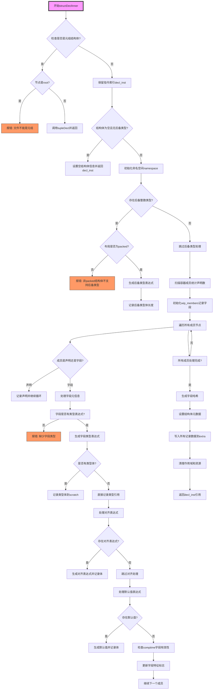

嗯，我需要为给定的Zig函数`structDeclInner`绘制一个流程图。首先，我需要理解这个函数的结构和各个部分的作用。这个函数看起来是处理结构体声明的内部逻辑，包括元组检查、空结构体处理、命名空间和作用域管理、字段类型和默认值的处理等等。

首先，我会从函数的开始部分开始分析。函数首先检查是否是元组结构体，如果是的话，可能会调用`tupleDecl`或者报错。然后，处理没有成员且没有后备整数类型的情况，直接设置结构体信息并返回。接下来，创建命名空间和作用域，处理后备整数类型（如果有的话），然后扫描容器成员，处理每个字段的类型、对齐、默认值等信息，最后生成结构体的元数据并将其写入AST生成器的额外数据中。

接下来，我需要将这些步骤转化为流程图中的各个节点。可能的节点包括：

1. 检查是否是元组结构体。
2. 处理空结构体。
3. 初始化命名空间和作用域。
4. 处理后备整数类型。
5. 扫描容器成员，统计声明和字段数量。
6. 遍历每个成员，处理字段的类型、对齐、默认值等。
7. 生成字段哈希。
8. 设置结构体信息并写入额外数据。

需要注意条件分支，比如是否有后备整数类型、是否是元组结构体、是否有字段体需要处理等。每个条件分支都需要在流程图中表示出来。例如，如果`backing_int_node`存在，则需要处理后备整数类型，否则跳过。同样，对于每个成员字段，需要检查是否有类型表达式、对齐表达式、默认值表达式等，并分别处理。

此外，还需要处理错误情况，比如在非打包结构体中指定后备整数类型会报错。这些错误处理也需要在流程图中体现，可能通过判断节点后连接到错误处理节点。

在绘制流程图时，要确保各个步骤的顺序正确，条件分支清晰，并且循环处理每个成员字段的部分用循环结构表示。可能使用子流程来表示复杂的部分，比如处理每个字段的详细步骤。

最后，需要确认所有资源释放和清理操作，比如`defer`语句中的`namespace.deinit(gpa)`和`block_scope.unstack()`，这些在流程图中应该作为结束步骤的一部分。

总结来说，流程图的绘制需要覆盖函数的主要逻辑分支、循环处理字段、错误检查以及资源管理。通过将这些步骤和条件分支可视化，可以更清晰地理解函数的工作流程。
================================================
