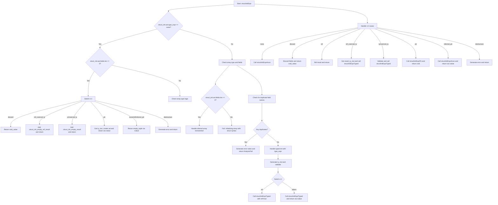

好的，我现在需要帮用户用Mermaid画出这个Zig函数的流程图。首先，我得仔细阅读并理解这段代码的结构和逻辑。

这个函数叫structInitExpr，处理结构体初始化表达式。看起来有很多条件分支，比如处理没有类型表达式的情况、数组类型、重复字段名检查，以及不同的结果信息（ResultInfo）处理。

首先，我会从函数开始的地方梳理流程。函数一开始检查struct_init.ast.type_expr是否为none，如果是，并且没有字段，就根据不同的rl（Result Location）情况返回不同的结果。比如discard情况下返回void_value，ref_coerced_ty则生成相应的节点。

接下来，如果type_expr存在，进入array块。这里处理数组类型的初始化，检查是否是推断数组长度，是否有sentinel等。如果字段不为空，则报错。

然后，代码处理重复的字段名。使用了一个栈分配的哈希表来记录字段名，如果发现重复，生成错误信息并返回AnalysisFail。

之后，如果存在type_expr，处理类型化的初始化，调用structInitExprTyped，并根据rl的不同情况返回结果。

最后，处理不同的rl情况，如none、discard、ref、ptr等，每个情况有不同的处理逻辑，比如是否需要解引用，是否需要存储到指针等。

现在，我需要将这些逻辑步骤转化为流程图。需要注意各个条件分支，比如if、switch等结构。例如，最开始的if (struct_init.ast.type_expr == .none) 和后续的else array:块，然后处理重复字段名的部分，再到根据rl的不同处理。

可能的结构是：

1. 开始
2. 检查type_expr是否为空且字段为空 → 根据不同rl处理
3. 否则处理数组类型的情况
4. 检查字段是否有重复 → 有则报错
5. 处理type_expr存在的情况 → 调用structInitExprTyped
6. 根据不同的rl情况进行处理 → 各分支返回结果

需要注意循环处理字段的部分，以及错误处理流程。可能需要用条件判断、并行处理分支，最后汇总到结束节点。

可能忽略一些细节，比如具体的Zir指令生成，但重点在流程控制结构。比如，处理重复字段时，遍历每个字段，检查重复，如果有重复则收集错误信息，最后返回错误。

然后，不同的rl情况用switch处理，每个case对应不同的流程路径。

这样，流程图的大致结构就能勾勒出来了。接下来用Mermaid语法将这些步骤结构化，使用判断节点、处理步骤和连接线。
================================================

这个流程图展示了函数的主要分支逻辑：
1. 首先检查类型表达式是否存在
2. 处理空字段的特殊情况
3. 处理数组类型逻辑
4. 字段名重复检查
5. 类型化初始化处理
6. 最后处理不同的结果位置（ri.rl）情况

各分支通过菱形判断节点连接，最终都会汇聚到返回或错误处理节点。黄色菱形表示条件判断，蓝色矩形表示操作步骤，红色矩形表示错误处理。