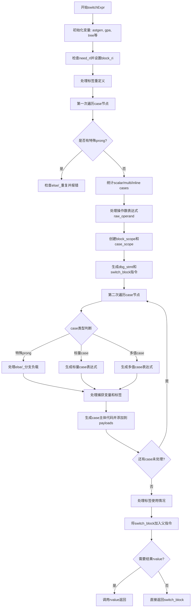

嗯，我需要画这个Zig函数的流程图。首先，我得仔细看看这个函数的逻辑。这个函数是处理switch表达式的，可能包括生成AST节点或者中间表示（Zir）的代码。函数名是switchExpr，参数有parent_gz、scope、ri、node、switch_full等。

首先，函数开始的时候，会初始化一些变量，比如astgen、gpa、tree，还有operand_node和case_nodes。然后检查是否有需要的结果位置（need_rl），设置block_ri。接着处理标签是否存在，防止重复定义。

接下来是第一遍遍历case节点，收集信息，比如是否有引用负载、是否有标签捕获、是否有非内联捕获等。同时检查是否有多个else或者_分支，如果有的话报错。

然后是处理操作数（operand_node），生成raw_operand。如果有标签，可能需要处理类型信息。接着处理块作用域，设置断点结果信息，可能生成dbg_stmt指令。

之后处理每个case，生成对应的负载和主体代码。对于每个case，处理捕获的变量，检查是否是引用，是否有标签捕获。然后生成对应的表达式，添加到payloads数组中。

在处理完所有case后，生成switch_block指令，并将其添加到父块的指令列表中。最后根据是否需要rvalue来决定返回值。

现在要把这些步骤转化为流程图。可能需要分几个大的步骤：初始化、处理case节点、生成操作数、处理每个case的主体、生成switch_block，以及最后的返回处理。

需要注意的是条件判断，比如是否有特殊分支（else或_），是否有多个case，是否需要结果rvalue等。这些条件会影响流程的分支。

可能的步骤：

1. 初始化变量和检查标签。
2. 第一次遍历case节点，收集信息并检查错误。
3. 处理操作数表达式。
4. 创建块作用域和设置断点信息。
5. 生成dbg_stmt指令和switch_block。
6. 处理每个case：
   a. 处理负载和标签捕获。
   b. 生成case的表达式和主体代码。
   c. 将case信息添加到payloads。
7. 处理标签是否被使用。
8. 将switch_block添加到父块。
9. 根据need_result_rvalue返回结果。

需要用mermaid的流程图语法表示这些步骤，包括判断条件和循环结构。
================================================
