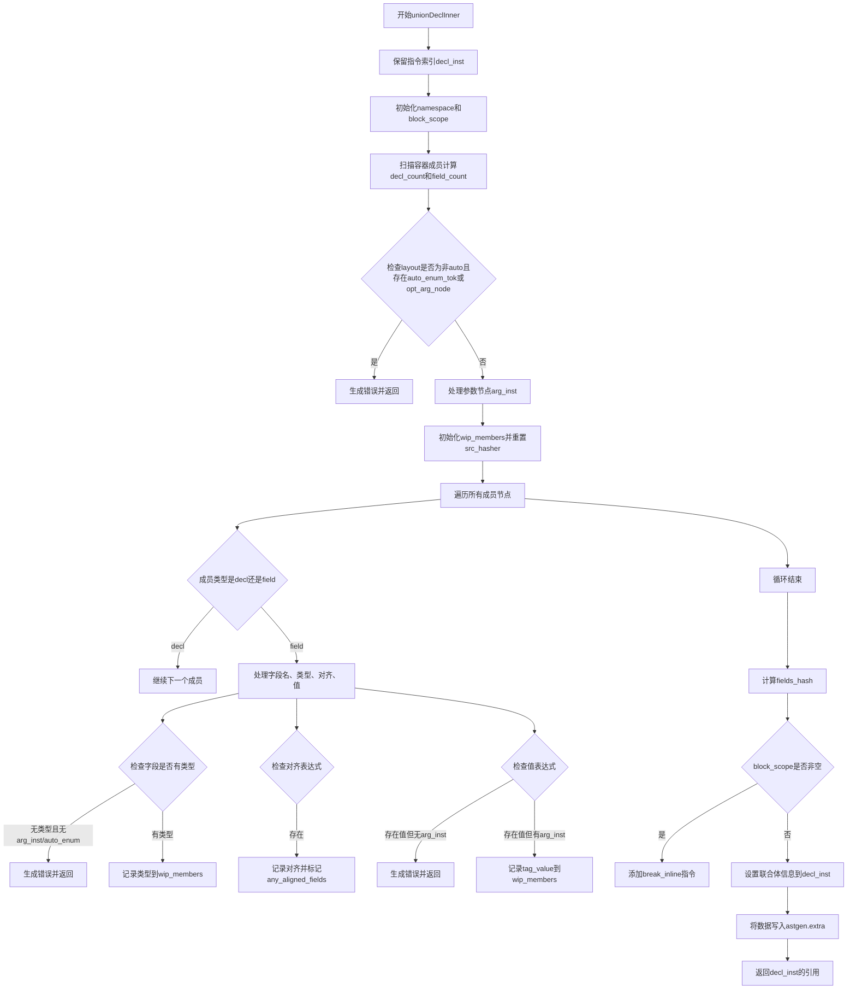

好的，我需要为提供的Zig函数`unionDeclInner`绘制流程图。首先，我需要理解这个函数的结构和逻辑。

首先，函数开始于一些参数的处理，比如检查布局是否为非auto且是否有自动枚举标记或参数节点，如果有的话会返回错误。然后初始化一些结构，如`namespace`和`block_scope`，并处理成员节点。

接下来，函数遍历所有成员节点，处理每个字段的类型、对齐和值。如果有错误（比如字段缺少类型或不允许comptime标记），会返回错误。同时，收集字段的信息到`wip_members`中，并生成哈希。

之后，处理块作用域的指令，设置联合体的信息，并将收集的数据写入AST生成器的`extra`数组中。最后返回生成的声明指令的引用。

绘制流程图时，需要将这些步骤分解为不同的节点，并用箭头连接它们，表示流程的顺序。同时，错误处理需要作为条件分支出现。

需要注意的是，有些步骤是并行的，比如初始化`namespace`和`block_scope`，但整体上还是顺序执行。循环处理成员节点需要一个循环结构。

在确定各步骤的逻辑顺序后，使用Mermaid的流程图语法来绘制，确保条件判断、循环和步骤之间的正确连接。
================================================
