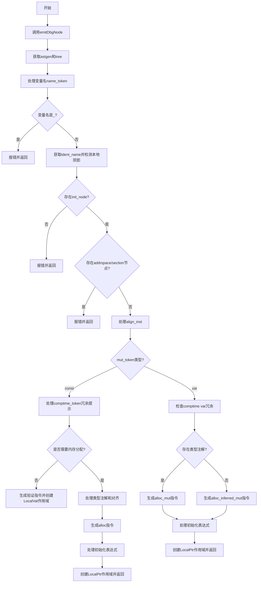

好的，我现在需要为给定的Zig函数`varDecl`绘制一个流程图。首先，我需要仔细阅读并理解这个函数的逻辑结构。这个函数处理变量声明，可能是针对常量和变量的不同情况。让我逐步分析代码的结构。

首先，函数开始于`fn varDecl(...)`，参数包括生成ZIR的指针`gz`，作用域`scope`，AST节点`node`，分配器`block_arena`，以及变量声明的AST信息`var_decl`。返回的是一个`Scope`指针或错误。

流程的第一步是调用`emitDbgNode`，可能用于生成调试信息。然后获取`astgen`和`tree`，分别对应AST生成器和语法树。

接下来是处理变量名。检查`name_token`对应的标识符是否为下划线`_`，如果是则报错。然后通过`identAsString`获取标识符名称，并进行本地变量阴影检测，防止重复声明。

然后检查是否有初始化节点`init_node`，如果没有则报错。接着处理`addrspace_node`和`section_node`，如果存在则报错，因为局部变量不支持这些属性。

处理对齐`align_inst`，如果有对齐节点则生成对应的表达式，否则设为`.none`。

然后根据`var_decl.ast.mut_token`的类型（`const`或`var`）分情况处理：

1. **`const`声明的情况**：
   - 如果有`comptime_token`，提示冗余并当作`comptime`处理。
   - 根据是否有类型注解和是否需要结果位置，决定是直接使用初始化表达式还是分配内存。
   - 处理对齐和是否为comptime的情况，生成对应的ZIR指令。
   - 创建`Scope.LocalVal`或`Scope.LocalPtr`子作用域并返回。

2. **`var`声明的情况**：
   - 检查是否在comptime作用域中重复使用`comptime var`。
   - 根据是否有类型注解生成对应的分配指令（如`alloc_mut`或`alloc_inferred_mut`）。
   - 处理初始化表达式，可能涉及解析推断类型。
   - 创建`Scope.LocalPtr`子作用域并返回。

在整个过程中，涉及到多个条件判断和不同的代码路径，比如处理对齐、类型注解是否存在、是否是comptime上下文等。错误处理方面，遇到非法情况（如缺少初始化、设置addrspace等）会立即返回错误。

接下来，我需要将这些逻辑步骤转化为流程图。流程图应涵盖函数的主要分支，包括错误检查、常量和变量的处理分支、内存分配方式、作用域创建等。需要注意条件判断的节点和可能的返回点，确保每个分支都有正确的流向。

可能的步骤包括：
- 开始
- 检查标识符是否为`_`
- 检测本地阴影
- 检查初始化节点是否存在
- 处理addrspace和section节点错误
- 处理对齐
- 根据mut_token分const和var处理
  - const分支：
    - 处理comptime冗余提示
    - 判断是否直接使用初始化表达式或需要分配内存
    - 生成对应ZIR指令
    - 创建作用域
  - var分支：
    - 处理comptime检查
    - 分配内存（类型注解与否）
    - 处理初始化
    - 创建作用域
- 返回作用域或错误

需要注意各个条件判断后的流程合并点，比如在const和var处理完毕后都会创建子作用域并返回。同时，错误情况会提前返回，不会继续后续步骤。

现在，我需要用Mermaid语法将这些步骤组织成流程图，使用不同的节点表示开始、结束、操作、条件判断等，并用箭头连接流程。
================================================
