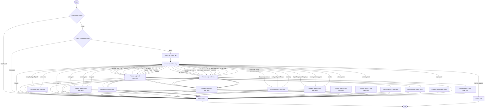

好的，我现在要尝试理解用户提供的Zig代码，并为其绘制流程图。首先，我需要仔细阅读这段代码，理解它的结构和逻辑。这个函数名为builtinCall，看起来是处理内置函数调用的。

首先，函数接收几个参数：astrl、block、ri、node和args。函数返回一个错误联合的布尔值。开头有_ = ri;，可能是暂时未使用这个参数。接下来获取tree、builtin_token和builtin_name，然后通过BuiltinFn.list.get查找内置函数的信息。如果找不到，返回false。接着检查参数数量是否符合预期，不符合也返回false。

然后是一个庞大的switch语句，根据不同的内置函数标签执行不同的处理。每个case处理不同的内置函数，调用astrl.expr来解析参数，传递不同的ResultInfo（如type_only或none）。每个case处理完参数后返回false，除了.frame_address返回true，可能是特例。

我的任务是画出这个函数的流程图。流程图应该从函数入口开始，逐步展示各个判断和处理分支。需要注意switch中的各个case，尤其是参数处理和返回值的不同情况。由于switch有很多分支，可能需要用子流程或合并相似分支来简化图表。

可能的步骤：
1. 开始函数。
2. 获取builtin信息，检查是否存在，参数数量是否正确。
3. 进入switch，根据不同的tag处理。
4. 每个tag对应的处理逻辑，调用expr并返回结果。
5. 处理完返回false或true。

需要注意处理不同case时的参数数量和ResultInfo类型，以及是否有特例（如.frame_address）。由于case很多，可能需要分组或归类，避免流程图过于复杂。例如，将处理单个参数、多个参数、特例返回等分开表示。

另外，需要确定每个case是否会影响流程的走向，比如是否有条件判断或不同的返回路径。大部分case在调用expr后返回false，但.frame_address返回true，这需要在流程图中明确标出。

总结流程图结构：
- 开始
- 获取builtin信息
- 检查是否存在和参数数量
- 进入switch，根据tag分支
- 每个tag处理参数并返回结果
- 结束

在绘制时，可能需要将每个case作为独立的分支，但可以合并类似处理逻辑的分支，例如所有处理单个参数且返回false的case可以合并为一个步骤，注明不同的tag但相同的处理方式。这样流程图不会过于冗长，同时保持清晰。
================================================

该流程图简化了部分重复逻辑，例如：
- 同类参数处理（如 `.size_of` 和 `.bit_size_of` 合并为同一分支）
- 用 `ProcessArgsX_YType` 表示连续参数的相同处理模式
- `.frame_address` 是唯一返回 `true` 的分支
- 其余分支最终均返回 `false`