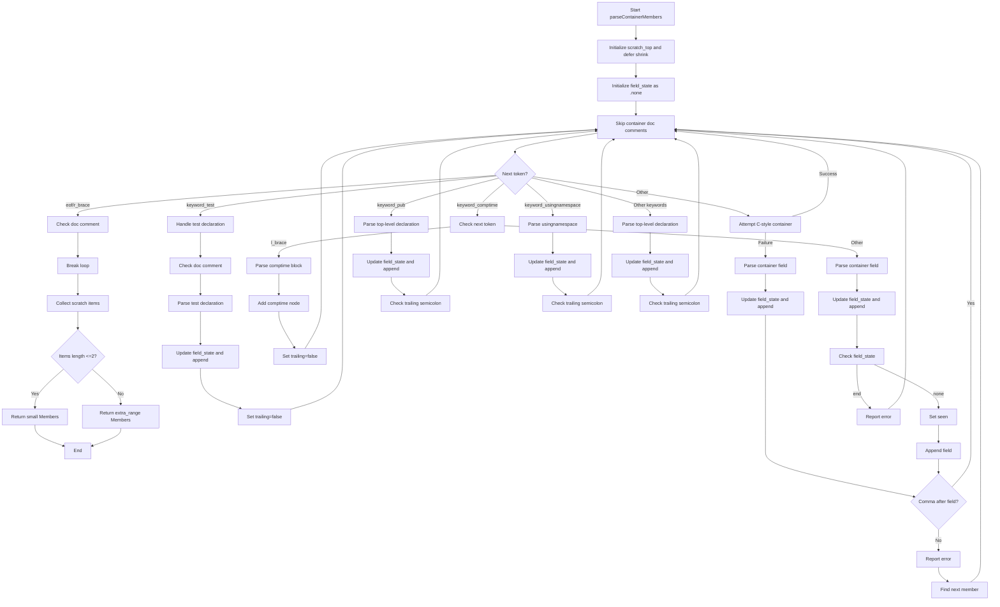

好的，我需要帮助用户根据提供的Zig代码绘制一个流程图。首先，我需要理解这个函数的功能和结构。这个函数名为parseContainerMembers，看起来是用于解析容器成员（比如结构体、枚举等的成员）的。函数中使用了大量的条件分支和循环，处理不同的token类型，比如测试声明、comptime块、公共声明、usingnamespace等。

首先，我需要通读代码，理清主要的逻辑流程。函数开始时初始化了一些状态变量，比如scratch_top和field_state。然后进入一个循环，不断处理不同的token。每个token类型对应不同的处理逻辑，比如.keyword_test、.keyword_comptime、.keyword_pub等。每个分支处理完后可能会修改field_state，并将解析结果添加到scratch中。

接下来，我需要确定如何将这些逻辑转化为流程图。流程图的开始应该是函数入口，然后是初始化步骤。之后进入主循环，根据不同的token类型分支处理。每个分支处理完后可能会有条件判断，比如是否继续循环或跳出循环。最后处理结果，返回Members结构。

需要注意的是，代码中有很多错误处理和恢复的逻辑，比如catch块和错误处理分支。这些也需要在流程图中体现，比如错误处理路径和恢复后的继续解析。

另外，循环中有多个break和continue的情况，需要正确表示循环的流程。同时，函数末尾根据scratch中的items长度返回不同的Members结构，这也是流程图的一个结束点。

在绘制流程图时，可能需要使用不同的形状来表示不同的操作，比如矩形表示处理步骤，菱形表示条件判断，平行四边形表示输入/输出等。同时，需要正确连接各个步骤，确保逻辑顺序正确。

可能遇到的挑战是如何简化复杂的条件分支，尤其是嵌套的switch语句和错误处理。需要确保流程图既详细又不至于过于复杂，保持清晰易读。

最后，需要检查流程图是否覆盖了所有主要的代码路径，包括错误处理、循环退出条件以及不同的返回情况。确保没有遗漏重要的逻辑步骤。
================================================
