嗯，我现在需要为这个Zig语言编写的parsePrimaryTypeExpr函数画一个流程图。首先，我需要理解这个函数的结构和逻辑。看起来这个函数处理不同类型的表达式，根据不同的token标签来分支处理。

函数开头有一个switch语句，检查当前token的标签。每个case对应不同的token类型，比如.char_literal、.number_literal等等。每个case里面都会生成相应的节点并返回。例如，遇到.char_literal时，会调用addNode方法创建一个字符字面量的节点。

接下来是一些关键字处理，比如.keyword_if对应解析if表达式，.keyword_switch处理switch表达式。还有处理结构体、枚举、联合等容器声明的部分，比如.keyword_struct会调用parseContainerDeclAuto方法。

然后是多行字符串字面量的处理，当遇到.multiline_string_literal_line时，会循环处理这些行，直到没有更多的该类型token，然后创建一个多行字符串节点。

对于标识符（.identifier），需要进一步检查下一个token是否是冒号，再根据后续的token来决定如何处理，比如内联循环或者块结构。这里的分支比较复杂，可能需要仔细分析不同情况。

还有一些处理内联关键字的部分，比如.keyword_inline，后面可能跟着for或while循环。此外，处理点符号（.period）时，可能涉及到枚举字面量或结构体初始化。

最后，处理错误关键字.error的情况，可能需要解析错误集合声明或者错误值。还有括号表达式的情况，处理分组表达式。

整体来看，这个函数有很多分支，每个分支对应不同的语法结构。为了画流程图，我需要将每个case转化为一个决策节点，然后根据条件分支到不同的处理步骤。可能需要使用多个菱形决策节点来表示不同的token检查，然后用矩形框表示处理步骤，箭头表示流程走向。

需要注意的是，有些case内部还有嵌套的switch或条件判断，比如处理.identifier时，会再次检查下一个token的类型。这时候流程图可能需要多层嵌套的决策节点。

另外，处理结构体初始化或数组初始化时，涉及循环解析多个元素，这可能需要循环结构的表示。不过流程图中的循环通常用箭头回到之前的步骤来表示，或者用判断节点来检查是否继续循环。

可能需要先列出所有主要的token处理分支，然后逐一细化每个分支的子流程。这样流程图的结构会更清晰，避免遗漏重要的处理步骤。

最后，确保流程图的开始和结束点正确，函数开始于检查当前token，结束于返回节点或null。
================================================

```mermaid
graph TD
    A[Start parsePrimaryTypeExpr] --> B{Check p.tokenTag}
    B -->|char_literal| C[Add char_literal Node]
    B -->|number_literal| D[Add number_literal Node]
    B -->|keyword_unreachable| E[Add unreachable_literal Node]
    B -->|keyword_anyframe| F[Add anyframe_literal Node]
    B -->|string_literal| G[Add string_literal Node]
    B -->|builtin| H[Call parseBuiltinCall]
    B -->|keyword_fn| I[Call parseFnProto]
    B -->|keyword_if| J[Call parseIf]
    B -->|keyword_switch| K[Call expectSwitchExpr false]
    B -->|keyword_extern/packed| L[Parse containerDeclAuto]
    B -->|keyword_struct/opaque/enum/union| M[Parse containerDeclAuto]
    B -->|keyword_comptime| N[Add comptime Node]
    B -->|multiline_string_literal_line| O[Process multiline string]
    B -->|identifier| P{Check next token}
    P -->|colon + inline/for/while/switch| Q[Parse control flow]
    P -->|else| R[Add identifier Node]
    B -->|keyword_inline| S[Parse inlinable]
    B -->|keyword_for/while| T[Parse loop]
    B -->|period| U{Check next token}
    U -->|identifier| V[Add enum_literal Node]
    U -->|l_brace| W[Process struct/array init]
    U -->|else| X[Return null]
    B -->|keyword_error| Y{Check next token}
    Y -->|l_brace| Z[Parse error set]
    Y -->|else| AA[Parse error value]
    B -->|l_paren| AB[Parse grouped expr]
    B -->|other| AC[Return null]
    
    C --> ZA[Return Node]
    D --> ZA
    E --> ZA
    F --> ZA
    G --> ZA
    H --> ZA
    I --> ZA
    J --> ZA
    K --> ZA
    L --> ZA
    M --> ZA
    N --> ZA
    O --> ZA
    Q --> ZA
    R --> ZA
    S --> ZA
    T --> ZA
    V --> ZA
    W --> ZA
    Z --> ZA
    AA --> ZA
    AB --> ZA
    AC --> ZA[End]
    
    style A fill:#f9f,stroke:#333
    style ZA fill:#bbf,stroke:#333
```
