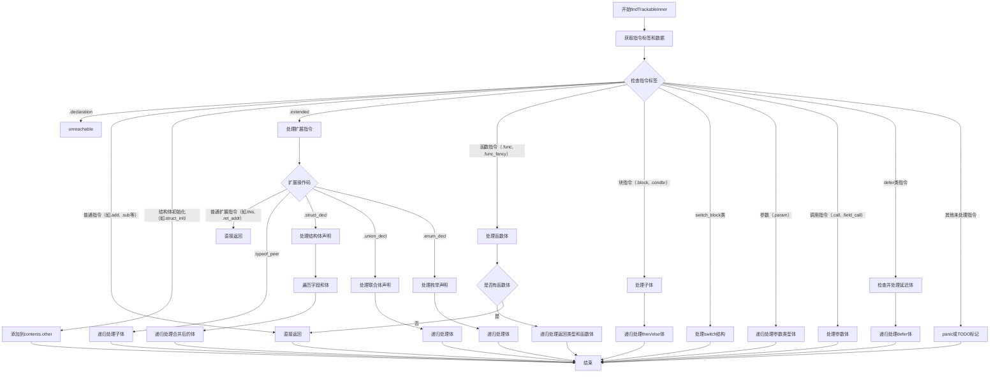

好的，我需要为提供的Zig函数`findTrackableInner`绘制一个流程图。首先，我要理解这个函数的结构和逻辑。

函数的主要目的是遍历ZIR（Zig Intermediate Representation）中的指令，并根据不同的指令类型处理它们。函数处理各种指令标签（tags），并根据不同的情况递归处理子指令或收集需要跟踪的内容。

首先，函数开始于一个`switch`语句，根据当前指令的标签进行不同的处理。大多数标签直接返回，不做任何操作，这些属于“boring”指令。但有一些特殊情况需要处理，比如结构体初始化、联合体声明、枚举声明、函数定义等，这些需要将指令添加到`contents`中或递归处理其子体。

接下来，处理`.extended`指令，其中包含更多的操作码（opcode），需要进一步的分支处理。例如，`.struct_decl`、`.union_decl`、`.enum_decl`等需要处理其内部结构，并递归处理它们的字段和体。

对于函数指令（如`.func`、`.func_inferred`、`.func_fancy`），需要处理返回类型和函数体，递归遍历其中的指令。

块指令（如`.block`、`.condbr`、`.switch_block`等）需要处理它们的子体，可能涉及条件分支或循环，需要递归处理每个分支的体。

此外，还有一些特殊情况处理，比如延迟执行（`defer`）和错误处理，需要检查是否已经处理过，避免重复。

在绘制流程图时，我需要将这些逻辑分支可视化，展示主要的判断点和处理流程。由于代码结构复杂，包含多层嵌套的switch和条件判断，流程图需要分层次展示每个主要分支，特别是处理不同指令类型时的递归调用和内容收集。

需要注意循环和递归处理的部分，例如在处理结构体、联合体、枚举声明时，需要遍历字段和体，这可能涉及多个层级的处理。同时，函数调用和块指令的处理也需要递归调用自身来处理子体。

最后，确保流程图的每个节点清晰表示一个判断或操作，箭头指示流程的方向，特别是递归和条件分支的部分。
================================================
