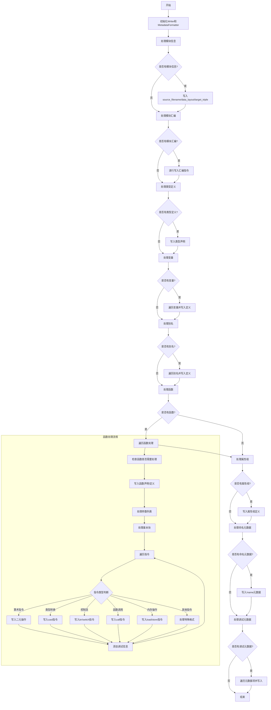

好的，我现在需要帮用户分析一个用Zig编写的函数，并生成对应的流程图。这个函数名为printUnbuffered，属于Builder结构体的方法。用户希望用Mermaid语法画出这个函数的流程图。

首先，我需要理解这个函数的功能。看起来这个函数是用来生成某种格式的输出，可能是LLVM IR或者其他类似的中间表示。函数接收一个backing_writer作为参数，可能是用来写入输出的。函数内部有很多条件判断，处理不同的部分，比如模块信息、汇编、类型、变量、别名、函数等等。然后，每个部分都会根据条件判断是否需要换行，并调用相应的格式化方法将内容写入writer。

接下来，我需要确定如何将这个复杂的函数转化为流程图。流程图通常包括开始、结束、判断、处理步骤等元素。这个函数的结构大致如下：

1. 初始化一些变量，如writer、metadata_formatter等。
2. 检查是否需要输出模块信息（source_filename, data_layout, target_triple），如果有，则写入相关内容。
3. 处理模块汇编（module_asm）。
4. 处理类型定义（types）。
5. 处理变量（variables）。
6. 处理别名（aliases）。
7. 处理函数（functions），这部分比较复杂，包含多个子步骤，比如处理函数属性、参数、基本块、指令等。
8. 处理属性组（attribute_groups）。
9. 处理元数据（metadata_named和metadata_formatter.map中的元数据项）。
10. 结束。

每个步骤之间可能需要根据条件判断是否需要插入换行。例如，每个部分开始前，如果need_newline为true，则先写入换行，然后将need_newline设为true，以便后续部分处理。

在处理函数部分时，循环遍历所有函数，处理每个函数的属性、参数、基本块和指令。这里可能涉及多个嵌套的循环和条件判断，比如处理不同的指令类型（call、br、load等），每个指令有不同的格式要求。

对于元数据的处理，可能涉及到生成调试信息，如DIFile、DICompileUnit、DISubprogram等，每个元数据项有不同的结构和需要写入的内容。

绘制流程图时，需要将这些主要步骤作为流程节点，条件判断作为菱形判断框，循环处理作为循环结构。由于函数较为复杂，可能需要分层或分块来组织流程图，避免过于庞大。

需要注意的是，Mermaid的流程图语法不支持嵌套的子流程，但可以通过分组和注释来提高可读性。可能需要将某些复杂部分（如处理函数）拆分为多个子流程，用单独的节点表示，并在节点内部用注释说明详细步骤。

另外，代码中有很多错误处理和资源释放（如defer语句），但在流程图中可能不需要详细体现，除非对流程有直接影响。重点应放在主要的处理步骤和逻辑分支上。

最后，确保流程图的逻辑顺序正确，每个步骤之间的转换符合代码的执行顺序。例如，模块信息处理完后才会处理模块汇编，接着是类型、变量等，最后处理函数和元数据。
================================================
