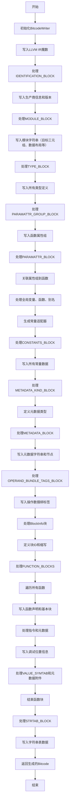

好的，我需要为给定的Zig函数`toBitcode`绘制一个流程图。首先，我需要理解这个函数的功能和结构。

函数`toBitcode`的作用是将LLVM IR转换为Bitcode格式。它使用了一个`Builder`结构体来收集和构造IR数据，然后将这些数据写入Bitcode格式。看起来函数的主要步骤包括初始化Bitcode写入器，写入不同的块（如IDENTIFICATION_BLOCK、MODULE_BLOCK等），处理类型、属性、全局变量、常量、元数据等，最后生成并返回Bitcode数据。

接下来，我需要将这个函数的流程分解成主要的步骤，每个步骤对应流程图中的一个节点。可能的步骤包括：

1. 初始化BitcodeWriter。
2. 写入LLVM IR的魔数。
3. 处理IDENTIFICATION_BLOCK，包括生产商信息。
4. 处理MODULE_BLOCK，包含模块级别的信息，如目标三元组、数据布局等。
5. 处理TYPE_BLOCK，写入所有类型定义。
6. 处理PARAMATTR_GROUP_BLOCK和PARAMATTR_BLOCK，写入函数属性。
7. 处理全局变量、函数和别名。
8. 处理CONSTANTS_BLOCK，写入所有常量。
9. 处理元数据相关的块（METADATA_KIND_BLOCK、METADATA_BLOCK等）。
10. 写入操作数捆绑标签和块信息。
11. 处理函数块（FUNCTION_BLOCKS），包括指令、基本块、元数据附件等。
12. 最后处理STRTAB_BLOCK，写入字符串表。
13. 返回生成的Bitcode数据。

在绘制流程图时，需要注意各个块之间的顺序和可能的条件分支，例如某些块可能只在特定条件下才会被处理。此外，每个主要步骤可能需要进一步分解为子步骤，例如在MODULE_BLOCK中处理不同类型的数据。

需要确认是否所有步骤都被正确涵盖，并且流程图的逻辑顺序正确。可能还需要考虑错误处理部分（如errdefer）是否在流程图中体现，但根据要求，可能主要关注主流程。

最后，使用Mermaid语法将这些步骤转化为流程图，确保节点和箭头正确表示函数执行的顺序和逻辑关系。
================================================
