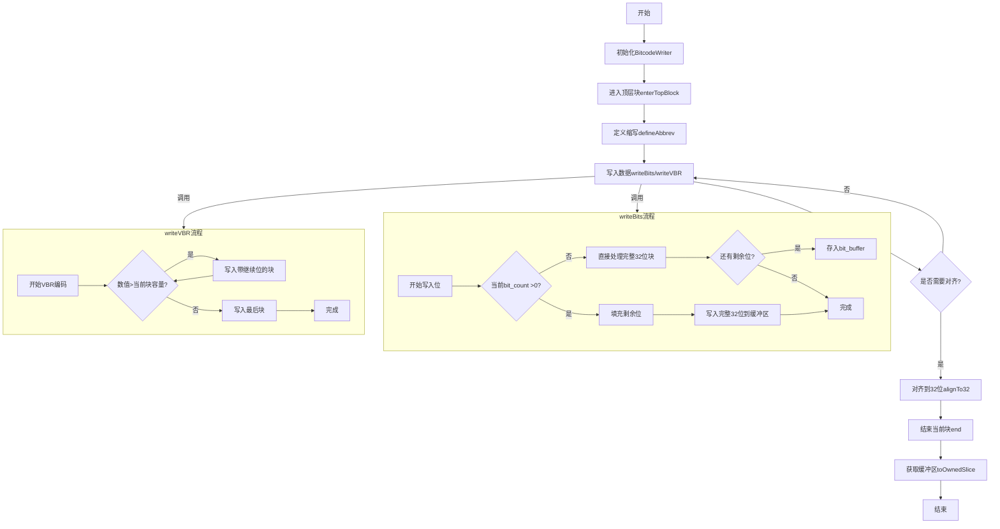

嗯，我现在需要为这个Zig函数BitcodeWriter画一个流程图。首先，我得理解这个函数的结构和功能。看起来这是一个用于生成LLVM Bitcode的写入器，可能涉及将数据按位和字节写入缓冲区，支持不同类型的编码方式，比如VBR（可变位率）和固定位宽编码，还有处理块结构、对齐等。

首先，我需要理清主要的函数和方法。BitcodeWriter返回一个结构体，里面包含各种方法，比如init、deinit、writeBits、writeVBR、alignTo32、enterTopBlock等。每个方法可能有不同的流程，但流程图通常需要一个总体的结构，可能从初始化开始，然后展示主要的写入流程，包括如何处理位缓冲、块操作等。

可能流程图的主线是：初始化BitcodeWriter，然后进入一个顶层块（enterTopBlock），在块内可能定义缩写（defineAbbrev），写入数据（writeBits, writeVBR），处理对齐（alignTo32），最后结束块（end）并获取最终的缓冲区（toOwnedSlice）。

但是具体每个方法的内部流程可能比较复杂。比如writeBits需要处理位缓冲，当当前位缓冲有部分数据时，将新数据填充进去，如果填满则写入缓冲区，剩下的部分继续处理。而writeVBR则是将数值分成多个块写入，每个块带有继续位。

另外，处理块结构时，比如enterTopBlock会创建一个BlockWriter，初始化时会写入块的头部信息，预留位置记录块大小，最后在end时回填块的大小。

需要考虑这些步骤如何连接，每个方法内部的判断和循环。例如，在writeBits中，可能需要判断当前bit_count是否为0，如果不是，则先填充剩余位，然后处理完整的32位块，最后处理剩余的位。而writeVBR则是一个循环，将数值分解成多个块，直到剩下的部分可以放入一个块中。

画流程图时可能需要将主流程分解为几个主要部分：初始化、写入数据（包括处理位缓冲和块写入）、处理块结构、对齐和结束块，最后获取结果。每个部分中的关键步骤和判断条件需要明确。

可能还需要考虑错误处理，比如函数返回Error!void，但在流程图中可能简化这部分，除非有特定的错误条件需要处理。

总之，流程图应该从初始化开始，展示如何写入不同类型的数据，处理块和子块，对齐缓冲区，最后结束块并获取最终的位码数据。需要将各个方法的关键步骤和它们之间的调用关系用流程图的节点和箭头表示出来。
================================================
