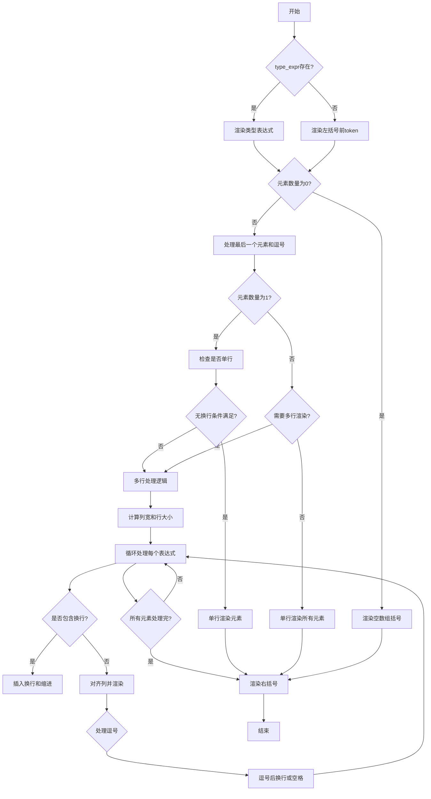

嗯，我需要为这个Zig函数`renderArrayInit`画一个流程图。首先，我得理解这个函数的结构和逻辑。让我仔细看看代码。

函数开始检查`array_init.ast.type_expr`是否存在，如果存在就渲染类型表达式，否则处理左括号前面的token。然后处理空数组的情况，直接渲染左右括号。如果有元素，继续处理最后一个元素和可能的逗号。接下来判断是否有注释或多行字符串，决定是否换行。如果不需要换行，尝试在一行内渲染所有元素，否则进入多行处理逻辑，包括计算列宽、处理每个表达式、处理逗号和换行等。

这个过程看起来有很多条件分支和循环，比如处理每个元素、判断行大小、处理注释等。我需要将这些步骤分解成流程图的各个节点，并用条件判断来连接它们。

首先，流程图应该从函数入口开始，然后根据`type_expr`是否存在分为两个分支。接着处理空数组的情况，如果是空的，渲染括号后结束。否则，检查元素数量是否为1，如果是，处理特殊情况。然后判断是否需要多行渲染，包括是否有注释或多行字符串。接下来是多行处理的具体步骤，包括分配宽度、处理每个表达式、处理逗号和换行，直到所有元素处理完毕，最后渲染右括号。

需要注意循环部分，比如`while (true)`循环处理每个部分，直到所有元素处理完。这里可能需要一个循环节点，并在满足条件时退出循环。

另外，错误处理方面，函数返回`Error!void`，但流程图中可能不需要特别处理错误，除非有明确的错误抛出点，但代码中主要是`try`，可能忽略错误处理，只关注主流程。

现在，我需要将这些步骤组织成流程图，使用Mermaid的语法。可能需要多个判断节点，比如判断数组是否为空、元素数量是否为1、是否需要多行渲染等。每个判断后的不同路径需要正确连接，循环部分用循环节点表示。

可能遇到的挑战是如何正确表示嵌套的条件和循环，特别是处理多行渲染时的内部循环和条件判断。需要确保每个分支都正确连接，并且流程清晰。

总结步骤：
1. 开始
2. 检查type_expr存在？是→渲染类型，否→渲染左括号前token
3. 检查元素数量是否为0？是→渲染空数组括号，结束
4. 否则，处理最后一个元素和逗号
5. 检查元素数量是否为1？是→特殊处理单个元素
6. 判断是否需要多行渲染（注释、多行字符串等）
7. 需要多行→进入多行处理循环，处理每个表达式，计算列宽，处理逗号和换行
8. 处理完所有元素→渲染右括号，结束
================================================
