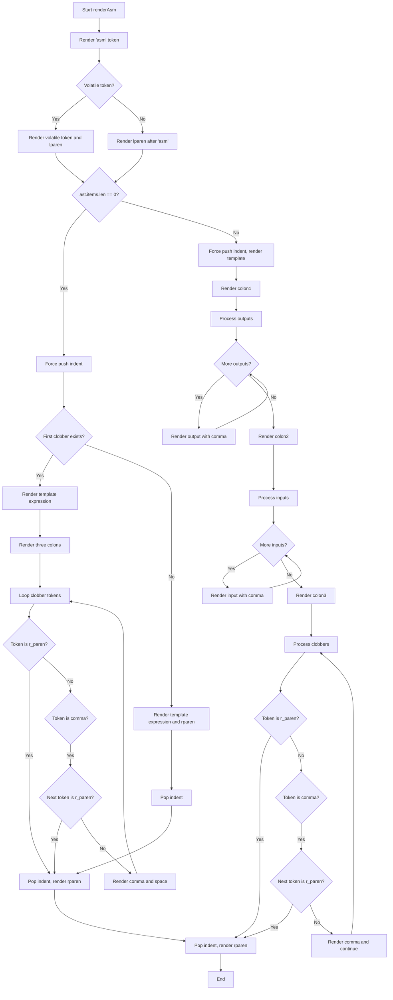

好的，我现在需要为给定的Zig函数`renderAsm`绘制一个流程图。首先，我需要理解这个函数的结构和逻辑流程，这样才能准确地将其转化为流程图。

首先，函数`renderAsm`接收三个参数：`r`（Render指针）、`asm_node`（Ast.full.Asm类型）和`space`（Space类型）。它返回一个错误联合的void。函数的主要作用似乎是渲染汇编代码的节点，处理不同的情况，比如是否有`volatile`关键字、不同的输出、输入和clobber列表等。

让我先大致浏览一下代码的结构：

1. 函数开始处，获取`tree`和`ais`，然后渲染`asm`的token。
2. 检查是否有`volatile_token`，如果有的话渲染相关token，否则直接处理左括号。
3. 如果`asm_node.ast.items`的长度为0，表示没有输出、输入或clobbers，这时候可能需要处理简单的`asm ("foo")`情况，或者有clobbers的情况。
4. 如果`asm_node.ast.items`不为空，则进入更复杂的处理流程，包括输出、输入和clobber部分的渲染。
5. 处理输出的部分（`colon1`和`colon2`），然后是输入部分（`colon3`），最后处理clobber列表，直到遇到右括号结束。

接下来需要将每个条件判断和循环转化为流程图的节点和分支。例如：

- 是否有`volatile_token`？
- `asm_node.ast.items.len == 0`？
- 是否有`first_clobber`？
- 处理输出列表的循环。
- 处理输入列表的循环。
- 处理clobber列表的循环。

每个条件判断会产生两个分支（是或否），每个循环可能需要用流程图的循环结构表示。需要注意代码中的`break`、`return`和可能的错误处理。

可能的流程图结构如下：

1. 开始节点：函数入口。
2. 渲染`asm` token。
3. 判断是否有`volatile_token`，是则渲染相关token，否则渲染左括号。
4. 判断`ast.items`是否为空：
   - 如果是空的：
     - 强制缩进。
     - 是否有`first_clobber`？
       - 有：渲染模板表达式，三个冒号，然后循环处理clobber tokens直到遇到右括号。
       - 无：渲染模板表达式，直接渲染右括号。
   - 如果不为空：
     - 强制缩进，渲染模板表达式。
     - 处理输出部分（`colon1`和`colon2`），可能涉及循环处理每个输出。
     - 处理输入部分（`colon3`），同样可能循环处理每个输入。
     - 处理clobber部分，循环处理直到右括号。
5. 结束节点：渲染右括号并返回。

需要注意各个条件之间的连接，特别是循环和嵌套结构。例如，处理输出和输入时的循环需要正确表示迭代过程，以及遇到结束条件（如右括号）时的退出路径。

可能遇到的难点包括：

- 处理多个嵌套的条件判断和循环，确保流程图的层次清晰。
- 正确表示循环中的条件判断，例如在clobber处理中根据token类型决定下一步操作。
- 确保所有可能的执行路径都被覆盖，包括提前返回的情况（如在某些条件下直接渲染右括号并返回）。

需要仔细检查代码中的每个分支，确保没有遗漏任何可能的路径。例如，在`if (asm_node.volatile_token)`分支后，无论是否存在volatile，都需要处理左括号。在`ast.items.len == 0`的情况下，处理有或没有`first_clobber`的情况。

此外，代码中多次调用`renderToken`和`renderExpression`，这些可能在流程图中表示为操作节点。缩进的处理（如`forcePushIndent`和`popIndent`）可能作为流程中的步骤，但可能不需要在流程图中详细显示，除非对理解流程至关重要。

综上所述，流程图的大致步骤应该是：

开始 → 渲染asm token → 处理volatile → 处理左括号 → 检查ast.items长度 → 根据长度分支处理 → 处理输出、输入、clobber部分 → 结束。

在具体绘制时，使用Mermaid的语法来表示条件判断（菱形节点）、循环（通过条件返回循环起点）、操作步骤（矩形节点）以及连接线。
================================================
