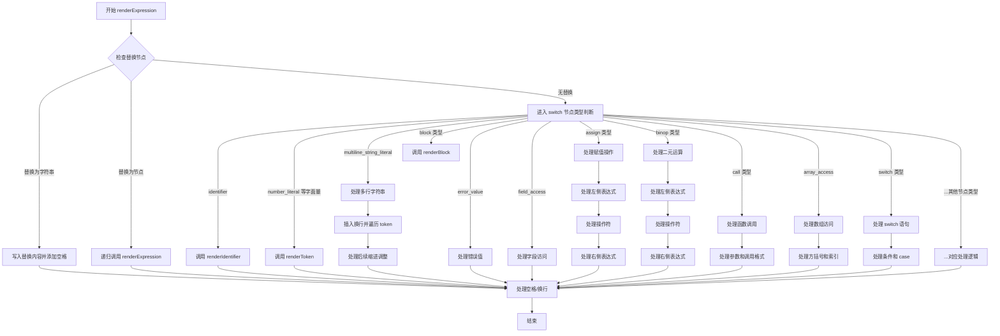

好的，我需要帮用户用Mermaid画出这个Zig函数`renderExpression`的流程图。首先，我得仔细阅读并理解这个函数的代码结构。函数看起来很长，有很多条件分支，特别是那个大的switch语句，里面处理了各种不同的AST节点类型。

首先，我应该理清函数的主要流程。函数开始检查是否有替换节点的情况，如果有的话就直接输出替换内容。否则，根据节点的类型（通过switch语句）进行不同的处理。每个case处理不同的AST节点，比如标识符、数字字面量、字符串字面量、块语句等等。每个case内部可能还有进一步的递归调用或其他处理逻辑。

接下来，我需要确定如何将这些复杂的逻辑转化为流程图。流程图应该从函数入口开始，按顺序展示各个判断和分支。由于函数中有很多条件分支，特别是那个大的switch，可能需要分层处理。比如，先处理顶层的if-else替换检查，然后是switch的不同case，每个case内部的处理步骤可能需要子流程。

需要注意的是，这个函数有很多递归调用，比如在处理某些节点时会再次调用`renderExpression`，这在流程图中可能需要用子流程或者循环结构来表示。不过，Mermaid的流程图主要处理线性的流程和分支，递归可能需要用单独的节点来表示调用自身。

另外，函数中有很多错误处理（比如`Error!void`返回类型），但代码中使用的是Zig的错误联合类型，但流程图中是否需要体现错误路径呢？用户可能更关注主流程，所以暂时可能先忽略错误处理，除非用户特别说明。

现在，开始绘制流程图的步骤：

1. 函数入口：renderExpression开始。
2. 检查replace_nodes_with_string是否存在，存在则写入替换内容并返回。
3. 否则检查replace_nodes_with_node是否存在，存在则递归调用renderExpression。
4. 如果都没有，进入switch语句，根据不同的节点类型处理。
5. 对于每个switch case，比如.identifier、.number_literal等，执行对应的处理逻辑，可能包括调用其他函数（如renderIdentifier、renderToken等）或继续处理子节点。
6. 处理完当前节点后，根据space参数决定添加空格、换行等。
7. 结束函数。

由于switch语句有非常多的case，如果每个都详细画出，流程图会非常庞大。可能需要将每个case简化为一个节点，例如“处理标识符节点”、“处理数字字面量”等，而具体的处理细节可以合并或简略表示。

此外，循环结构如for循环处理多行字符串字面量，也需要在流程图中体现循环步骤。

可能遇到的挑战是如何在不过于复杂的情况下清晰地表达主要逻辑。可能需要分层，先画顶层流程，再为复杂的case单独画子图。但由于用户希望一个流程图，可能需要简化处理，将主要分支列出，细节用注释说明。

总结，流程图的大致结构如下：

- 开始
- 检查替换节点（字符串或节点），处理并返回
- 进入switch，根据节点类型分支到不同处理块
- 每个case处理对应的AST类型，可能调用其他函数或递归
- 处理完毕后处理空格/换行
- 结束

现在，根据这个结构用Mermaid语法绘制流程图。注意使用条件判断和子流程节点，尽量保持简洁。
================================================

流程图说明：
1. 入口先检查节点替换逻辑，快速返回替换内容
2. 核心通过 switch 语句处理 40+ 种 AST 节点类型
3. 主要分支用简写表示（实际代码中每个 case 对应特定处理逻辑）
4. 复杂操作如赋值/二元运算拆解为三步处理
5. 最终统一处理空格/换行后结束
6. 省略了部分细节（如错误处理、注释判断等）以保持可读性