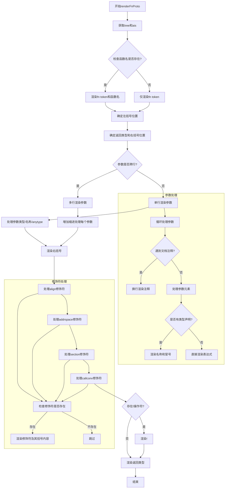

嗯，我现在需要画一个函数`renderFnProto`的流程图，这个函数是用Zig语言写的。首先，我需要理解这个函数的功能。看起来这个函数是用来渲染函数原型的，也就是将AST中的函数原型节点转换成具体的代码表示。这包括处理函数名、参数、返回类型以及可能的修饰符如align、addrspace、section、callconv等。

首先，我应该通读代码，理清逻辑结构。函数开始处理`fn_proto.ast.fn_token`，然后处理函数名是否存在，接着处理左括号。接下来处理参数列表，分两种情况：一种是参数在同一行，另一种是每个参数占一行。之后处理返回类型前的修饰符，比如`align`、`addrspace`等，最后处理返回类型本身。

接下来，我需要确定各个条件分支和循环结构。例如，处理参数时有一个循环遍历参数，根据是否有逗号或注释来决定换行。此外，处理修饰符时有多个条件判断，每个修饰符需要单独处理。

流程图的基本元素包括开始、结束、处理步骤、条件判断、循环等。我需要将这些结构转化为Mermaid的流程图语法。可能需要将复杂的条件分支拆分成多个节点，确保逻辑清晰。

需要注意的是，函数中有多个if语句和循环，比如处理参数时的while循环，以及处理各种修饰符的条件判断。此外，还有一些断言（assert）和错误处理（Error!void），但流程图可能不需要显示错误处理路径，除非特别重要。

可能遇到的难点是如何将嵌套的条件和循环结构合理地在流程图中表示，同时保持图表简洁易懂。例如，处理参数列表时有两种情况：同一行或每行一个参数，这需要不同的处理步骤。此外，处理各种修饰符时，每个修饰符的存在性检查都需要条件分支。

我应该从函数入口开始，逐步分解每个主要步骤，然后处理分支和循环。确保每个条件判断都有对应的分支路径，并正确连接各个步骤。同时，注意函数的结束点，即返回渲染后的返回类型。

最后，检查流程图是否覆盖了所有主要的逻辑路径，没有遗漏重要的条件或步骤。可能需要多次调整结构，确保流程图的准确性和可读性。
================================================
