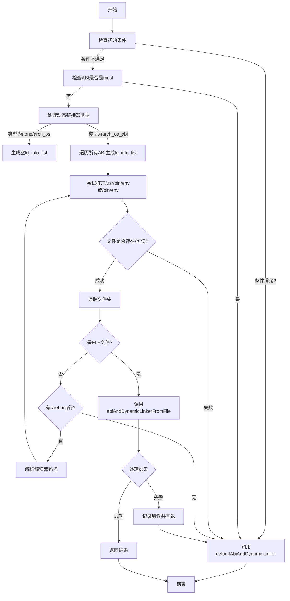

嗯，我需要用Mermaid来画出这个Zig函数的流程图。首先，我得仔细阅读这个函数，理解它的逻辑结构。这个函数叫做detectAbiAndDynamicLinker，看起来是用来检测目标系统的ABI和动态链接器的。函数里有很多条件判断，比如检查操作系统类型、是否有动态链接器、处理不同的ABI等等。

首先，函数开始处有一些变量声明，比如native_target_has_ld、is_linux等。然后是一系列的if条件判断，比如检查是否已经拥有所有必要的信息，如果是的话就直接调用defaultAbiAndDynamicLinker。这里可能需要一个判断框，根据条件决定是否进入默认处理。

接下来，如果query.abi存在并且是musl，那么同样进入默认处理。这部分需要另一个条件分支。

然后，函数处理不同的动态链接器类型，比如.none、.arch_os、.arch_os_abi。对于.arch_os_abi的情况，会遍历所有可能的ABI，生成ld_info_list。这部分可能需要循环结构。

之后，函数尝试打开/usr/bin/env文件，检查是否是ELF文件或者有shebang行。如果是ELF文件，继续处理；如果是shebang，则递归解析指向的文件。这部分可能需要一个循环，直到找到ELF文件为止。

最后，调用abiAndDynamicLinkerFromFile处理ELF文件，如果出现错误则回退到默认处理。

在画流程图时，需要注意各个条件分支的走向，循环结构，以及错误处理的部分。可能需要使用不同的形状来表示开始、结束、判断、处理步骤等。同时，由于函数中有多个嵌套的条件和循环，需要合理安排流程图的布局，确保逻辑清晰。

可能需要将整个函数分解为几个主要部分：初始判断、ABI处理、动态链接器类型处理、文件检查（ELF/shebang）、错误处理。每个部分对应流程图中的一个子流程。对于递归解析shebang的部分，可能需要一个循环结构来表示重复打开文件直到找到ELF文件。

另外，函数中的错误处理部分有很多不同的错误类型，但最终很多错误都会回退到调用defaultAbiAndDynamicLinker。在流程图中，可以将这些错误处理合并为一个共同的路径，指向默认处理。

总结一下，流程图的步骤可能是：
1. 开始
2. 检查初始条件（如have_all_info等），如果是，调用default处理
3. 检查ABI是否是musl，如果是，调用default处理
4. 根据动态链接器类型处理不同的情况，生成ld_info_list
5. 尝试打开/usr/bin/env文件
6. 检查文件是否是ELF或shebang，如果是shebang则递归解析
7. 如果是ELF文件，调用abiAndDynamicLinkerFromFile
8. 处理可能的错误，如果出错则调用default处理
9. 结束

在绘制时需要注意各个步骤之间的连接线，条件判断的分支，以及循环结构。使用Mermaid的语法来表示这些元素，比如条件判断使用菱形，处理步骤使用矩形，循环使用箭头和条件标签。
================================================

流程图说明：
1. 函数从初始条件检查开始，若满足条件直接调用默认处理
2. 检查ABI是否是musl，决定是否进入默认处理
3. 根据动态链接器类型生成不同的ld_info_list
4. 递归解析/usr/bin/env文件：
   - 若文件是ELF则分析ABI/动态链接器
   - 若包含shebang则递归解析目标解释器路径
5. 最终通过abiAndDynamicLinkerFromFile获取结果或回退到默认处理
6. 所有路径最终汇聚到结束节点

菱形节点表示条件判断，矩形节点表示处理步骤，箭头上的文字表示判断条件，橙色路径表示错误处理流程。