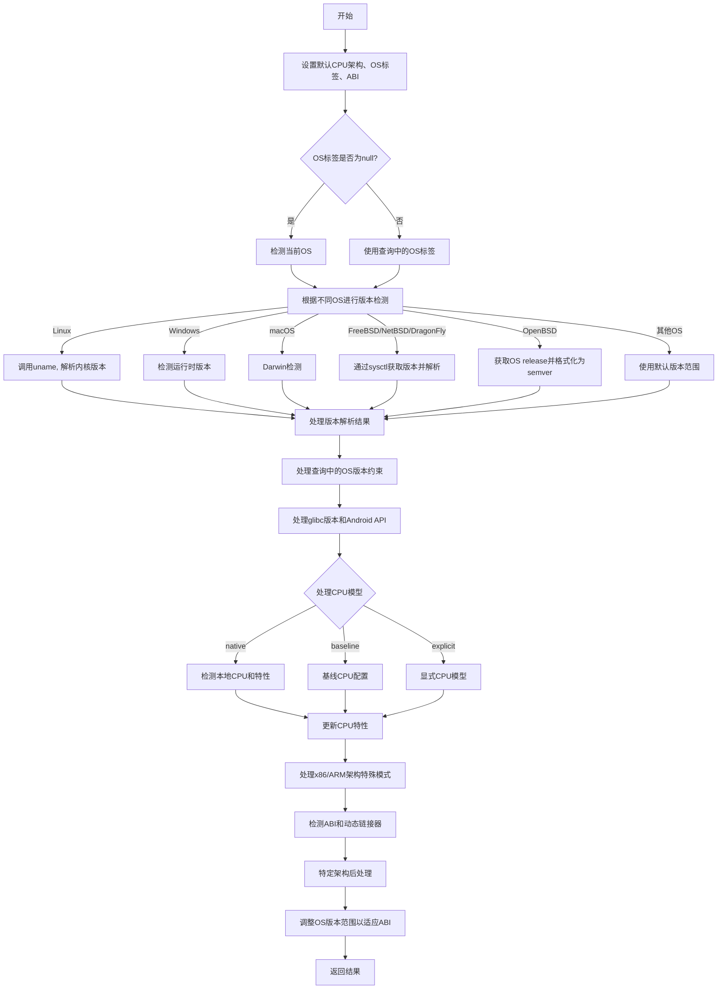

嗯，我需要为这个Zig函数`resolveTargetQuery`画一个流程图。首先，我应该先通读代码，理解它的主要步骤和逻辑结构。这个函数的主要作用似乎是解析目标查询，检测操作系统版本，处理CPU架构和特性，以及处理ABI和动态链接器。

首先，函数开始处处理`Target.Query`参数，设置默认的CPU架构、操作系统标签和ABI。然后根据不同的操作系统标签，比如Linux、Solaris、Windows、macOS等，进行特定的版本检测。例如，在Linux上调用`posix.uname()`获取系统信息，解析内核版本；在Windows上调用`windows.detectRuntimeVersion()`；在macOS上使用Darwin相关的检测方法。

接下来，处理FreeBSD、NetBSD、DragonFlyBSD和OpenBSD等BSD系统的版本检测，每个系统有不同的版本解析方式。例如，FreeBSD通过sysctlbyname获取版本信息，然后进行数学运算得到主版本、次版本和补丁版本。

然后，函数处理查询中的操作系统版本最小值和最大值，以及glibc版本和Android API级别。接着处理CPU模型，包括检测本地CPU、基线配置或显式指定的模型。对于x86架构，根据ABI设置16位或32位模式，并更新CPU特性。

之后，检测ABI和动态链接器，并进行一些特定架构的后处理，比如Hexagon和ARM的特定特性处理。最后，根据检测到的ABI调整操作系统版本范围，确保兼容性。

现在，我需要将这些步骤转化为流程图。流程图的开始是函数入口，然后是各个条件分支，针对不同的操作系统标签进行处理，接着是CPU和ABI的处理，最后返回结果。需要注意条件判断和循环结构，比如switch语句和错误处理。

可能的结构是：

1. 开始
2. 设置默认的CPU架构、OS标签、ABI
3. 根据OS标签进入不同的版本检测分支
   - Linux: 解析uname的release版本
   - Windows: 检测运行时版本
   - macOS: Darwin检测
   - 各种BSD系统：通过sysctl获取版本信息并解析
4. 处理查询中的OS版本范围、glibc、Android API
5. 处理CPU模型和特性
6. 检测ABI和动态链接器
7. 特定CPU后处理（Hexagon、ARM）
8. 调整OS版本范围以适应ABI
9. 返回结果

需要注意错误处理的部分，比如在解析版本失败时的处理，以及不同情况下的默认值设置。另外，流程图中需要体现出条件分支和可能的错误路径。

可能需要将每个操作系统标签的处理作为不同的分支，每个分支内部有详细的步骤。例如，在Linux分支中，调用uname，解析版本，设置版本范围等。同样，对于每个BSD变种，处理方式不同，需要分别画出。

在流程图中，使用菱形表示条件判断，矩形表示处理步骤，箭头表示流程方向。错误处理可能需要单独的路径，例如返回错误或使用默认值。

最后，整合所有步骤，确保逻辑正确，没有遗漏重要的处理环节。
================================================

该流程图展示了：
1. 初始默认值设置
2. 操作系统检测的多路分支（包含Linux/Windows/macOS/BSD等特殊处理）
3. 版本约束处理流程
4. CPU特性检测的三个路径（本地/基线/显式）
5. 架构特定处理（x86模式设置、Hexagon/ARM特性调整）
6. 最终的ABI适配和结果返回
7. 整个过程保持对查询参数的响应和错误处理机制