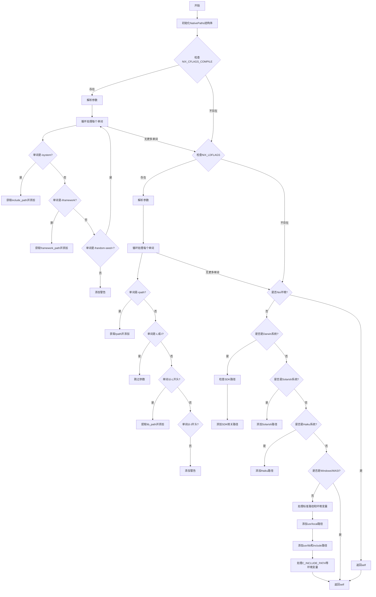

嗯，用户给了我一个用Zig编写的函数，叫做detect，属于NativePaths模块。他们的要求是让我用Mermaid语法画出这个函数的流程图。首先，我需要理解这个函数的结构和逻辑流程，然后才能转化为流程图。

首先，函数detect接收一个Allocator和一个native_target，返回一个NativePaths或错误。函数开始初始化一个NativePaths结构体，并检查环境变量NIX_CFLAGS_COMPILE和NIX_LDFLAGS。如果检测到这些变量，说明是在Nix环境下，会解析这些变量中的参数，比如-isystem、-iframework、-rpath等，添加相应的路径或警告。

接下来，如果is_nix为真，直接返回self。如果不是Nix环境，根据不同的操作系统处理不同的路径。例如，如果是Darwin（macOS），会检查SDK路径、Homebrew路径。对于Solarish系统、Haiku系统等，添加特定的库和包含目录。对于非Windows和非WASI系统（比如Linux），处理各种标准的包含路径和库路径，还考虑环境变量如C_INCLUDE_PATH、CPLUS_INCLUDE_PATH、LIBRARY_PATH。

我需要将所有这些条件分支和循环结构转化为流程图。需要注意的是，流程图中需要涵盖所有的条件判断，比如不同的操作系统判断，环境变量的存在与否，以及循环处理每个tokenize后的参数。

可能的难点在于如何正确表达循环结构，比如处理NIX_CFLAGS_COMPILE中的每个单词，以及处理环境变量中的多个路径。此外，错误处理部分，比如捕获错误并返回，也需要在流程图中体现。

另外，用户提供的代码中有一些TODO注释，比如考虑添加MacPorts路径，但当前代码中未实现，这可能不需要在流程图中体现，除非用户特别说明。

总结一下，流程图的大致步骤是：

1. 初始化NativePaths结构体。
2. 检查NIX_CFLAGS_COMPILE环境变量，解析其中的参数，添加路径或警告。
3. 检查NIX_LDFLAGS环境变量，解析参数，添加路径或警告。
4. 如果是Nix环境，返回结果。
5. 如果不是Nix环境，根据操作系统类型处理不同路径：
   - Darwin：处理SDK和Homebrew路径。
   - Solarish：添加特定库和包含目录。
   - Haiku：添加特定库目录。
   - 非Windows/WASI：处理标准路径和环境变量中的路径。
6. 返回最终的NativePaths结构体。

需要将这些步骤用Mermaid的流程图语法表示，注意条件判断和循环结构。例如，使用菱形表示条件判断，矩形表示操作，箭头表示流程方向。
================================================
