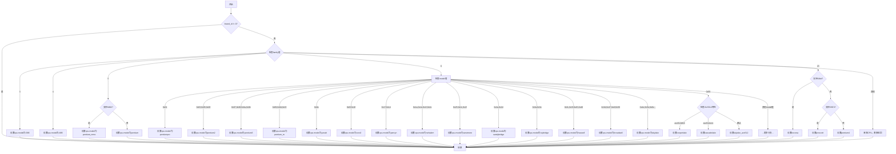

好的，我现在需要为给定的Zig函数绘制一个Mermaid流程图。首先，我得仔细理解这个函数的结构和逻辑。

函数名为detectIntelProcessor，接受cpu指针、family、model、brand_id作为参数。首先检查brand_id是否为0，如果不是的话直接返回。如果是0，则根据family的值进入不同的处理分支。

接下来是switch(family)的结构。family的可能值有3、4、5、6、15以及其他情况。对于每个case，特别是family为6时，里面还有一个根据model值的嵌套switch，处理各种不同的CPU型号。例如，model为0x01对应pentiumpro，0x03、0x05、0x06对应pentium2等。还有一些情况需要检查CPU特性，比如是否支持MMX或某些AVX指令集。

当family是15时，又根据是否支持64位或SSE3来分配不同的模型。其他情况则直接返回，不修改cpu.model。

我需要将这些逻辑转化为流程图。流程图应该从函数入口开始，依次判断各个条件分支，包括外层的family判断和内层的model判断，以及可能的特性检查。

需要注意的是，每个条件判断后的操作通常是设置cpu.model并返回。因此，每个分支结束于一个操作节点，然后流程终止。

可能的结构是：

1. 开始
2. 检查brand_id !=0 → 是 → 结束
3. 否 → 进入family判断
4. family=3 → 设置i386 → 结束
5. family=4 → 设置i486 → 结束
6. family=5 → 检查是否有MMX → 设置pentium_mmx或pentium → 结束
7. family=6 → 进入model的switch → 每个model对应不同的CPU模型 → 结束
8. family=15 → 检查64bit → 设置nocona → 否则检查sse3 → 设置prescott → 否则设置pentium4 → 结束
9. 其他family → 结束

对于family=6的情况，内部的model判断非常复杂，有多个可能的model值，每个对应不同的CPU模型。可能需要将这部分简化为一个大的分支结构，列出主要的model判断和对应的操作。

由于Mermaid流程图需要简洁，可能需要将某些详细分支合并或用注释表示，以避免图表过于复杂。例如，可以将family=6的model判断部分作为一个子流程，详细展开或者用简化的方式表示。

此外，对于某些条件中的特性检查，如Target.x86.featureSetHas(cpu.features, .mmx)，也需要在流程图中体现为判断节点。

最后，确保所有可能的路径都被覆盖，包括默认情况（else）直接返回的情况。
================================================

注：为保持简洁性，family=6的model分支只展示了部分典型值，实际实现包含更多具体model判断。图中用`...更多分支...`表示未完全展开的同类操作，完整实现需覆盖所有switch case。