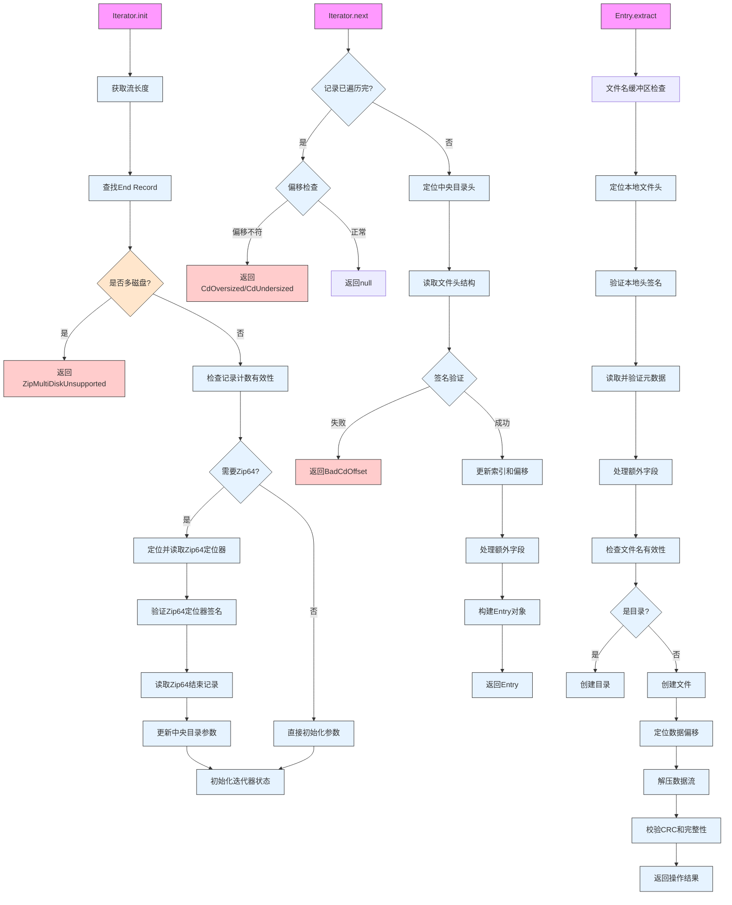

嗯，用户让我用Mermaid画一个Zig函数的流程图。首先，我需要理解这个Zig代码的结构和功能。看起来这是一个处理ZIP文件的模块，包含了一个`Iterator`函数，返回一个结构体，该结构体有`init`和`next`方法，以及一个`Entry`结构体，里面还有`extract`方法。

首先，我需要确定流程图的起点和终点。整个模块的主要功能是遍历ZIP文件中的条目并提取它们。所以流程图应该从初始化开始，然后是读取目录记录，接着遍历每个条目，最后处理每个条目的提取过程。

接下来，我需要分解`init`函数。它首先获取流的长度，然后查找结束记录（End Record），检查是否支持多磁盘，处理可能的Zip64扩展信息，最后初始化迭代器的状态。这部分流程需要详细画出各个检查步骤，比如验证结束记录的有效性、处理Zip64的情况等。

然后是`next`方法，它负责遍历中央目录记录。每次调用`next`时，会检查是否还有更多记录，读取文件头信息，解析可能的额外字段（如Zip64信息），最后返回一个`Entry`结构。流程图需要展示这些步骤，包括错误处理，比如当目录大小不符时的错误。

`Entry`结构体的`extract`方法比较复杂。它需要定位到本地文件头，验证元数据，处理文件名，创建目录或文件，解压数据，并校验CRC。这部分流程需要详细画出文件定位、数据解压、错误检查等步骤。

在绘制流程图时，要注意各个函数之间的调用关系，比如`init`返回迭代器实例，`next`遍历条目，`extract`处理每个条目的内容。同时，错误处理分支也需要明确标出，比如遇到多磁盘、不支持的Zip版本或加密文件时的错误返回。

可能需要将整个流程图分为几个部分：初始化部分、遍历条目部分、提取条目部分。每个部分内部包含条件判断和循环结构。例如，在`next`方法中，当`cd_record_index`等于`cd_record_count`时，检查偏移量是否正确，否则继续读取下一个条目。

另外，需要注意一些细节，比如Zip64扩展的处理，中央目录记录的解析，以及解压数据时的流控制。这些步骤都需要在流程图中体现出来，确保逻辑清晰，步骤明确。

最后，总结整个流程，确保所有可能的路径都被覆盖，包括正常流程和各个错误处理分支。这样生成的Mermaid流程图才能准确反映代码的执行逻辑。
================================================
