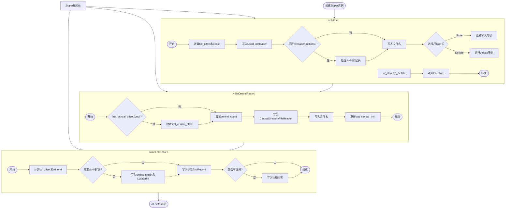

嗯，用户让我用Mermaid画出一个Zig函数的流程图。首先，我需要理解这段代码的结构和逻辑。这个Zig代码定义了一个名为Zipper的结构体，它包含一些方法和成员变量，用于处理ZIP文件的写入。

首先，我会看一下主要的函数：writeFile、writeCentralRecord和writeEndRecord。这些函数分别负责写入文件数据、中央目录记录和结束记录。我需要理清每个函数的步骤以及它们之间的调用关系。

对于writeFile函数，它似乎负责写入本地文件头，处理压缩（比如Store或Deflate），然后返回一个FileStore结构。里面有一些条件判断，比如是否有header_options，是否使用zip64扩展等。这些条件分支需要在流程图中体现。

接下来是writeCentralRecord，它用于写入中央目录记录，更新first_central_offset和central_count，以及写入相应的头部信息。同样，这里可能有一些条件判断，比如检查first_central_offset是否为null。

然后是writeEndRecord，处理ZIP的结束记录，包括可能的zip64扩展。这里有很多条件判断，根据传入的选项设置不同的字段值。这部分逻辑可能比较复杂，需要仔细分析每个条件。

在画流程图时，我需要确定每个函数的入口和出口，以及主要的步骤。比如writeFile的流程可能包括：计算文件偏移，计算CRC32，写入本地文件头，处理文件名，处理压缩，最后返回FileStore。每个步骤之间的顺序和条件分支都要画清楚。

需要注意的是，Zig中的错误处理（比如try语句）可能会影响流程，但流程图可能不需要详细展示所有错误路径，除非用户特别要求。此外，结构体的初始化和成员变量的更新也需要在流程中体现，比如central_count的增加。

还有，用户提供的代码中有一些条件判断和可选字段，比如header_options是否为空，zip64是否存在等。这些都需要在流程图中用判断节点表示。

最后，整个Zipper结构体的使用流程可能需要展示如何依次调用这三个函数来生成完整的ZIP文件。可能还需要考虑结构体的初始化步骤，但用户提供的代码中没有构造函数，可能需要假设用户已经正确初始化了结构体。

总结一下，我需要将每个函数分解成步骤，用Mermaid的流程图语法表示，包括开始、结束、操作步骤、条件判断和循环（如果有的话）。确保每个函数的流程清晰，并且函数之间的调用关系正确。
================================================

该流程图包含以下特点：
1. 用三层子图分别表示三个主要方法的内部逻辑
2. 使用菱形节点表示条件判断
3. 展示了关键操作如压缩方式选择、zip64处理等
4. 最后部分展示了典型的调用顺序
5. 保留了ZIP规范的关键要素：本地文件头->中央目录->结束记录的结构
6. 使用绿色圆角矩形表示开始/结束节点
7. 使用黄色矩形表示关键操作步骤
8. 箭头方向表示程序执行流向