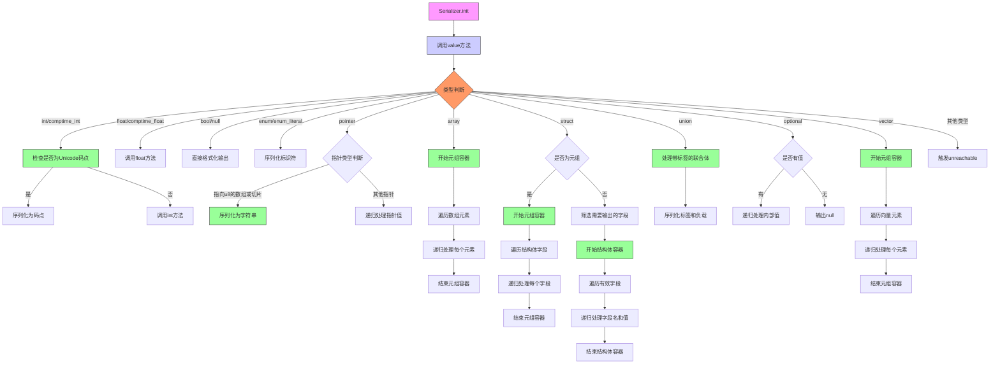

嗯，我需要为这个Zig代码中的`Serializer`函数画出流程图。首先，我得仔细读一下代码，理解它的结构和各个方法的作用。

看起来`Serializer`是一个泛型结构体，接受一个`Writer`类型参数。它有很多方法，比如`init`、`value`、`int`、`float`等等，用来序列化不同类型的数据。主要的逻辑在`valueArbitraryDepth`方法里，这里根据不同的类型（如整数、浮点数、布尔值、结构体、联合体等）调用相应的序列化方法。

接下来，我需要确定如何将这样的代码转换为流程图。可能需要从`Serializer`的初始化开始，然后根据不同的数据类型分支处理。例如，当调用`value`方法时，会根据输入的类型选择不同的处理路径：整数、浮点数、结构体等。每个处理路径可能有子流程，比如序列化结构体时需要处理每个字段，可能递归调用`valueArbitraryDepth`。

另外，注意到有`beginStruct`和`beginTuple`这样的方法，用于处理复合类型。这些方法可能涉及到容器的开始和结束，处理字段的分隔符和缩进等。

需要考虑流程中的各个判断条件，比如类型检查、选项设置（如是否换行、缩进等），以及错误处理。例如，在序列化字符串时，需要检查是否有无效的回车符，并处理可能的错误。

可能需要将整个流程分为几个主要部分：初始化、类型判断、序列化处理、容器处理（结构体/元组）、错误处理等。每个部分内部再详细展开分支。

不过，由于代码结构比较复杂，涉及多个递归和嵌套结构，流程图可能会比较庞大。可能需要分层展示，先画出主流程，再细化各个分支的子流程。

在画流程图时，使用Mermaid的语法，用不同的节点表示函数调用、条件判断、循环等。例如，开始节点是调用`Serializer.init`，然后根据不同的类型进入不同的处理分支，每个分支内部可能调用其他方法，如`int`、`float`等，最后结束容器处理并返回结果。

需要注意处理递归的情况，比如结构体或元组内部的字段可能又是结构体或元组，这时候需要递归调用`valueArbitraryDepth`。在流程图中可能需要用子流程或循环来表示这种递归结构。

总结一下，流程图的步骤可能如下：
1. 初始化Serializer。
2. 调用`value`方法，传入需要序列化的值。
3. 根据值的类型进入不同的处理分支。
4. 对于基本类型（如int、float），直接格式化输出。
5. 对于复合类型（如结构体、元组），开始容器，遍历每个字段，递归处理每个字段的值。
6. 处理字符串时，检查有效性并格式化。
7. 处理错误情况，如无效的Unicode码点或超过最大深度。
8. 结束容器，处理缩进和换行。
9. 完成序列化，输出结果。

在绘制过程中，需要确保每个判断和循环都被正确表示，并且各步骤之间的逻辑关系清晰。可能需要多次调整结构，以确保流程图既准确又易于理解。
================================================
